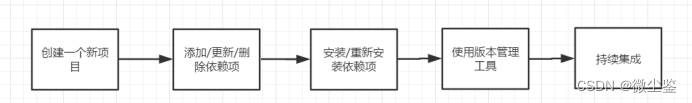

## 一、nvm是什么？
?>在工作中，我们可能个或者多个不同的项目开发，每个项目的需求不同，进而不同项目必须依赖不同版本的NodeJS运行环境，这种情况下，对于维护多个版本的node将会是一件非常麻烦的事情，nvm就是为解决这个问题而产生的，他可以方便的在同一台设备上进行多个node版本之间切换。
## 二、nodejs是什么？
>简单的说 Node.js 就是运行在服务端的 JavaScript。Node.js 是一个基于Chrome JavaScript 运行时建立的一个平台。Node.js是一个事件驱动I/O服务端JavaScript环境，基于Google的V8引擎，V8引擎执行Javascript的速度非常快，性能非常好。
## 三、根据nvm安装nodejs？
### 1、下载安装
[nvm安装包下载地址](https://github.com/coreybutler/nvm-windows/releases)，windows系统下载nvm-setup.zip安装包
### 2、配置代理环境
在安装路径下的setting.txt中配置淘宝的下载代理，配置内容如下：
```
root: E:\Install\NodeJs\nvm
path: C:\Program Files\nodejs
arch: 64 
proxy: none
node_mirror: http://npm.taobao.org/mirrors/node/
npm_mirror: https://npm.taobao.org/mirrors/npm/
```
### 3、 选择版本安装nodejs
>nvm install 12.13.1 //安装NodeJs
nvm list //查看安装的版本
nvm use 12.13.1   //使用指定版本
[ps]nvm其他常用命令如下:
nvm off                     // 禁用node.js版本管理(不卸载任何东西)
nvm on                      // 启用node.js版本管理
nvm install <version>      // 安装node.js的命名 version是版本号 例如：nvm install 8.12.0
nvm uninstall <version> // 卸载node.js是的命令，卸载指定版本的nodejs，当安装失败时卸载使用
nvm ls                         // 显示所有安装的node.js版本
nvm list available       // 显示可以安装的所有node.js的版本
nvm use <version>    // 切换到使用指定的nodejs版本
nvm v                       // 显示nvm版本
nvm install stable    // 安装最新稳定版

### 4、Node环境变量配置
#### 4.1、创建建文件夹

#### 4.2、执行命令
>npm config set prefix "E:\Install\NodeJs\nvm\node_global"
npm config set cache "E:\Install\NodeJs\nvm\node_cache"

#### 4.3、设置环境变量

>NODE_PATH  E:\Install\NodeJs\nvm\node_global\node_modules
NVM_HOME   E:\Install\NodeJs\nvm
NVM_SYMLINK   C:\Program Files\nodejs
Path  E:\Install\NodeJs\nvm\node_global

所有设置完点击确定，即配置完成。
## 四、切换为阿里镜像
>npm install -g cnpm --registry=https://registry.npm.taobao.org  //切换成阿里国内镜像
>

## 五、安装YARN模块
>[Yarn](https://yarn.bootcss.com/docs/usage/):Yet Another Resource Negotiator，是一个快速、可靠、安全的依赖管理工具，一款新的JavaScript包管理工具。
>

>npm install yarn -g
yarn -v
yarn config list


