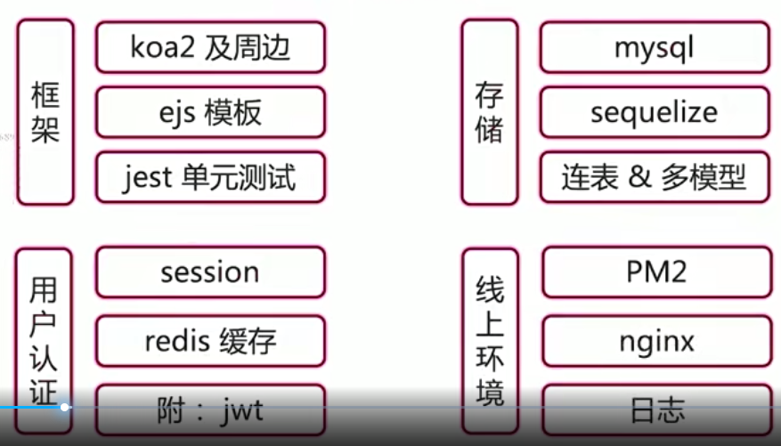
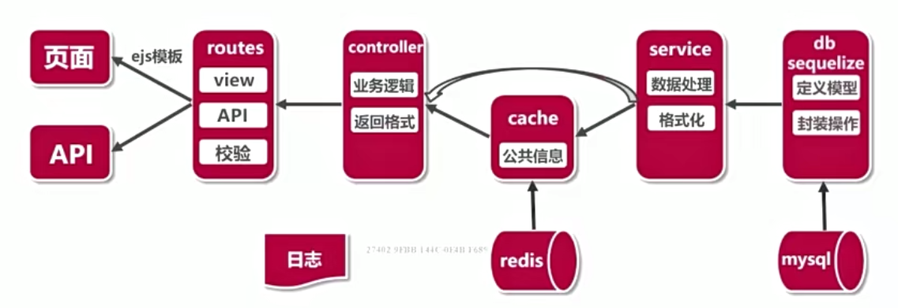
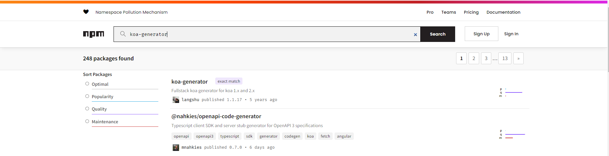
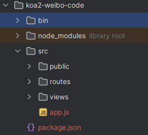

## 前言
**1、知识点介绍**    
  
**2、架构图设计**  

## 一、技术选型
>涉及框架、存储及缓存、用户认证
```
* 框架选型(koa2 vs express vs egg)
* 数据库选型(mysql vs monogodb)
* 登录技术(session vs jwt)
* 前端页面(ejs后端模版引擎 vs vue/react前端框架)
* 缓存数据库(redis)
* 单元测试(jest)
```
## 二、知识点串讲
>koa2和ejs模版、mysql和sequelize、redis、session和jwt、jest单元测试、eslint和inspect debug等等
## 三、技术方案设计
>架构设计、接口和路由、数据表和存储模型
## 四、功能开发
```
用户:登录、注册、用户设置、粉丝和关注
微博:发布、列表(首页、个人、广场页)
@功能:@某人、回复、接受@到我的消息
```
### 1、创建项目
NPM 介绍
npm 是世界上最大的开放源代码的生态系统。我们可以通过 npm 下载各种各样的包，这些源代码（包）我们可以在 https://www.npmjs.com 找到。

```
npm install -g koa-generator
koa2 -e koa2-weibo-code
npm install --save-dev cross-env
I use this in my npm scripts:
{
 "scripts": {
   "prd": "cross-env FIRST_ENV=production pm2 start bin/www",
 }
}
npm i --registry=https://registry.npmmirror.com
npm run dev
```
[ps]框架是提供一套完整的解决方案，按照规定好的代码结构来做编排，使用前段框架可以降低界面开发周期和提高界面的美观性。
特点：
-封装原生代码的API
-规范流程和格式
-让开发人员更加关注于业务代码，提高开发效率

### 2、目录结构


?>[koa](http://koa.bootcss.com/)对网络请求采用了中间件的形式处理,中间件可以介入请求和相应的处理,是一个轻量级的模块,每个中间负责完成某个特定的功能。中间件的通过next函数联系,执行next()后会将控制权交给下一个中间件,如果没有有中间件没有执行next后将会沿路折返,将控制权交换给前一个中间件。
```
1.koa:面向node.js的表达式HTTP中间件框架，使Web应用程序和API更加令人愉快地编写。Koa的中间件堆栈以类似堆栈的方式流动，允许您执行下游操作，然后过滤和处理上游的响应。
2.koa-router:(koa的路由中间件)
3.koa-views:(koa的模板渲染中间件) ctx：为网络处理上下文,next指向下个中间件
4.koa-bodyparser:用来解析body的中间件，比方说你通过post来传递表单，json数据，或者上传文件，在koa中是不容易获取的，通过koa-bodyparser解析之后，在koa中this.body就能直接获取到数据。ps：xml数据没办法通过koa-bodyparser解析，有另一个中间件koa-xml-body。
5.promise-mysql:Promise-mysql是mysqljs / mysql的一个包装函数，它包含Bluebird承诺的函数调用。通常这会用Bluebird的.promisifyAll()方法完成，但是mysqljs / mysql的脚本与Bluebird所期望的不同。
对于重复的代码我们将它封装在一起，方便使用，提高代码的重用性，DbUtil.js
```

### 3、koa2路由
```
const router = require('koa-router')()

//返回页面
router.get('/', async (ctx, next) => {
    await ctx.render('index', {
    title: 'Hello Koa 2!'
    })
})

//单个参数查询
router.get('/getUserById/:id',async(ctx, next) => {
    const {id} = ctx.params;
    ctx.body = {
        title: 'this is user info page',
        id
    }
})

//登录post方法
router.post('/login', async(ctx, next) =>{
    const {username,password} = ctx.request.body;
    ctx.body = {
        username,
        password
    }
})

module.exports = router
```

### 4、[ejs模版引擎](https://ejs.bootcss.com/)
```
<h1><%= title %></h1> // 输出变量title的值

<% if (isAdmin) { %> // 条件判断
  <p>Welcome, admin!</p>
<% } else { %>
  <p>Welcome, guest!</p>
<% } %>

<ul>
<% users.forEach(user => { %>
  <li><%= user.name %> (age <%= user.age %>)</li>
<% }) %>
</ul>
```
   

### 5、mysql & [sequelize](https://www.sequelize.cn/)
?>Sequelize 是一个基于 Promise 实现的 Node.js ORM 框架，用于与关系型数据库进行交互。它支持多种数据库，包括 PostgreSQL、MySQL、SQLite 和 MSSQL。Sequelize 提供了强大的功能，如模型定义、关联、事务管理、查询构建和数据验证等。
``` 
1、模型定义和映射
Sequelize 允许您通过定义模型来映射数据库表。模型是 JavaScript 类，代表了一个数据库表的结构和行为。通过模型，您可以轻松地进行 CRUD（创建、读取、更新、删除）操作。
2、关联和联接
Sequelize 提供了丰富的关联功能，使您能够在不同的模型之间建立关系，如一对一、一对多和多对多关系。这使得在查询时可以轻松地跨表进行联接操作，提供了更强大的数据检索和操作能力。
3、事务管理
Sequelize 支持事务，这是在复杂的数据库操作中至关重要的功能。通过使用事务，您可以确保一系列数据库操作的原子性，要么全部成功，要么全部失败。这对于确保数据的完整性和一致性非常重要。
4、查询构建
Sequelize 提供了强大而灵活的查询构建功能，使您可以使用链式调用方式构建复杂的查询。您可以使用简单的方法链和条件表达式来过滤、排序、分页和聚合数据，以满足各种查询需求。
5、数据验证
Sequelize 具有内置的数据验证机制，可以在模型定义中指定字段的验证规则。这样，您可以确保在将数据保存到数据库之前进行有效性检查，并且可以轻松地处理输入数据的验证和清理。
``` 
#1、全局安装sequelize-auto、mysql2
>npm install -g sequelize-auto mysql2

#2、在对应的文件夹下执行以下命令
>sequelize-auto -h 127.0.0.1 -d local -u root -x 123456 -p 3306 -t 表名

#3、使用第三步生成的Models
>const Sequelize = require('sequelize');  
const SequelizeInstance = require('../../config/db'); // sequelize的实例  
const User = require('../../models/user')(SequelizeInstance, Sequelize); // 导入用户的模型

```
const Sequelize = require('sequelize');

const dbConfig = {
    dialect: 'mysql',     // 数据库类型
    host: '127.0.0.1',      // 数据库服务器IP
    username: 'root',   // 用户名
    password: '123456',     // 数据库密码
    database: 'local',      // 数据库名
}

const mysql = new Sequelize(
    dbConfig.database,
    dbConfig.username,
    dbConfig.password,
    {
        host: dbConfig.host,
        dialect: dbConfig.dialect, //数据库类型(postgres)
        // 设置时区
        timezon: '+08:00',
        define: {
            timestamps: false //为模型添加 createdAt 和 updatedAt 两个时间戳字段（true or false）
        },
        pool: { //使用连接池连接，默认为true
            max: 50,
            min: 0,
            acquire: 30000,
            idle: 30000
        }
    }
)

// 测试连接是否成功
// mysql.authenticate().then(()=>{
//     console.log('Connection has been established successfully.');
// }).catch((error)=>{
//     console.error('Unable to connect to the database:', error);
// })

module.exports = mysql;
```
```
var execSql=require('./DbUtil.js');

function SingerDb(){

}
SingerDb.prototype.querySinger=async function(){
  let sql='select * from singer';
  return execSql(sql);
}
SingerDb.prototype.querySingers=async function(){
    let sql='select id,name from singer';
    return execSql(sql);
}
SingerDb.prototype.addSinger=async function(singer){
    let sql=`insert into singer (name,englishname,guoji,chushengdi,jobs,picName) values ('${singer.name}','${singer.englishname}','${singer.guoji}','${singer.chushengdi}','${singer.jobs}','${singer.picName}')`;
    // execSql(sql).then(function(rows){
    //     return rows;
    // });
    return execSql(sql);
}
SingerDb.prototype.delSinger=async function(id){
    let sql=`delete from singer where id=${id}`;
    return execSql(sql);
}
SingerDb.prototype.querySingerById=async function(id){
    let sql=`select * from singer where id=${id}`;
    return execSql(sql);
}
SingerDb.prototype.updateSinger=async function(singer){
    let sql=`update singer set name='${singer.name}' where id=${singer.id}`;
    return execSql(sql);
}
// let singer={
//     name:'张靓颖',
//     englishname:'amanda',
//     guoji:'中国',
//     chushengdi:'中国湖南',
//     jobs:'歌手'
// }

// new SingerDb().addSinger(singer);
// new SingerDb().querySinger();
module.exports=new SingerDb();
```

## 五、线上环境
>pm2和多进程、nginx和反向代理、日志
> 
## 六、总结最佳实战
>项目结构、错误处理、代码风格、质量保证、安全、线上环境

## 后记
[Markdown使用方法](https://blog.csdn.net/weixin_44766698/article/details/123153384)  
[Koa2——中间件](https://www.cnblogs.com/crbluesky/p/7931946.html)  
[koa2从入门到部署全过程](https://www.cnblogs.com/wangzisheng/p/16170716.html)  
[Sequelize：Node.js 中的强大 ORM 框架](https://blog.csdn.net/qq_31754591/article/details/130959607)  
[koa2从项目搭建到连接mysql再到参数校验](https://blog.csdn.net/qq_36694183/article/details/128253910)  
[Nodejs ORM框架Sequelize快速入门](https://www.cnblogs.com/ysk123/p/10222202.html)
