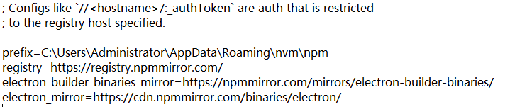

## 前言

> 在数字化时代，桌面应用程序依然是许多企业和个人用户不可或缺的工具。随着Web技术的飞速发展，利用前端技术栈开发桌面应用已成为一种趋势。Electron、Vite和Vue3的结合，为我们提供了一个强大而灵活的解决方案，能够快速开发出美观、功能丰富的跨平台桌面应用。

## 一、Electron+Vite+Vue3组合

【1】Electron简介

Electron是一个使用Web技术（HTML, CSS, 和JavaScript）来创建跨平台桌面应用程序的框架。它结合了Chromium和Node.js，让开发者能够使用前端技术来编写应用界面，并通过Node.js访问底层操作系统功能。**优势如下**：

- **跨平台**：一次编写，可在Windows、macOS和Linux上运行。
- **丰富的API**：可通过Node.js访问系统级的API。
- **易于开发**：利用前端技术栈，降低学习曲线。

【2】Vite+Vue3现代前端开发体验

Vite是一个现代化的前端构建工具，它利用原生ESM（ES Module）提供了极快的冷启动和热模块替换（HMR）。结合Vue3，可以带来更加高效、简洁的开发体验。

**Vue3特性**：

- **Composition API**：提供了一种更灵活、更强大的代码组织方式。
- **更好的性能**：通过Proxy实现响应式系统，提升性能。
- **Teleport和Fragments**：增强组件的灵活性和功能。

**Vite优势**：

- **极速的启动和热更新**：提升开发效率。
- **轻量**：无需打包操作，直接启动服务。
- **丰富的插件生态**：支持多种前端框架和库。

## 二、全局设置`Electron`镜像

【1】打开npm配置文件

```
npm config edit #cmd运行打开配置文件
```

【2】在空白处添加`electron`镜像保存即可(`缺什么补什么，但要是同一个公司单位的镜像`)

```
registry=https://registry.npmmirror.com/
electron_mirror=https://cdn.npmmirror.com/binaries/electron/
electron_builder_binaries_mirror=https://npmmirror.com/mirrors/electron-builder-binaries/
```

 

## 三、快速搭建基础工程

> 采用开源的[Electron构建脚手架](https://github.com/electron-vite/electron-vite-vue):https://github.com/electron-vite/electron-vite-vue

【1】使用命令创建工程

```
npm create electron-vite
```

 

【2】安装依赖

```
npm config set registry=https://registry.npmmirror.com/ #指定npm国内镜像
npm config set electron_mirror=https://npmmirror.com/mirrors/electron/ #指定Electron的国内镜像地址
npm config set electron_builder_binaries_mirror=https://npmmirror.com/mirrors/electron-builder-binaries/
```

没全局设置`electron`镜像，可执行如上命令在项目下添加`electron`镜像.

```
npm i
```

【3】运行工程

```
npm run dev
```


【4】打包工程

```
npm run build
```

运行成功后，在根目录下会多一个release目录，如下图所示


## 参考连接

[1]Electron+Vite+Vue3:打造高效跨平台桌面应用的利器：https://developer.baidu.com/article/details/3322290

[2]Electron+Vue3全家桶：https://blog.csdn.net/qq_42365534/category_12271233.html

[3]Electron镜像安装：https://blog.csdn.net/qq_38463737/article/details/140277803