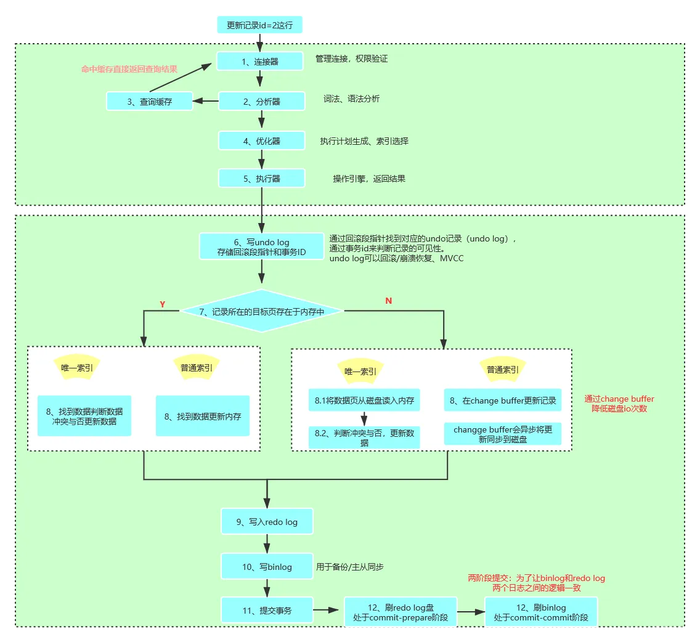
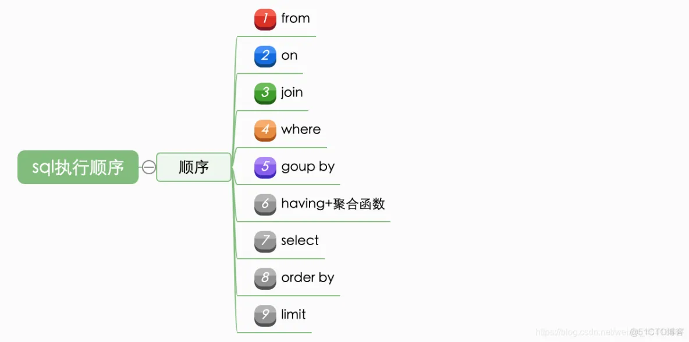

## Mysql 一个字段匹配多个字符

1、单个值查询使用myql函数：FIND_IN_SET()。
```
SELECT * FROM `by_content` WHERE FIND_IN_SET('1',title);
```

2、多个值模糊查询，使用mysql正则：REGEXP。此方式相当于( LIKE '%1%' OR LIKE '%3%' OR LIKE '%5%' )
```
SELECT * FROM `by_content` WHERE title REGEXP '(1|3|5)';
```

3、多个值匹配查询，使用mysql正则：REGEXP，此方式相当于( FIND_IN_SET('1',title) OR FIND_IN_SET('3',title) OR FIND_IN_SET('5',title) )
```
SELECT * FROM `by_content` WHERE title REGEXP '(^|,)(1|3|5)(,|$)';
```

## MySQL 锁表后快速解决方法

第1步　查看表是否在使用。
`show open tables where in_use > 0;`如果查询结果为空,则证明表没有在使用。结束。  
如果查询结果不为空，继续后续的步骤。
```
mysql>  show open tables where in_use > 0 ;  
+----------+-------+--------+-------------+
| Database | Table | In_use | Name_locked |
+----------+-------+--------+-------------+
| test     | t     |      1 |           0 |
+----------+-------+--------+-------------+
1 row in set (0.00 sec)
```

第2步　查看数据库当前的进程，看一下有无正在执行的慢SQL记录线程。
>show processlist;show processlist 是显示用户正在运行的线程，需要注意的是，除了 root 用户能看到所有正在运行的线程外，其他用户都只能看到自己正在运行的线程（即与您正在使用的MySQL帐户关联的线程），看不到其它用户正在运行的线程。如果不使用FULL关键字，Info字段中只显示每条语句的前100个字符。

第3步　批量删除事务表中的事务  
这里用的方法是：通过information_schema.processlist表中的连接信息生成需要处理掉的MySQL连接的语句临时文件，然后执行临时文件中生成的指令。
```
SELECT concat('KILL ',id,';') FROM information_schema.processlist p INNER JOIN  information_schema.INNODB_TRX x ON p.id=x.trx_mysql_thread_id WHERE db='test';
```
这个语句执行后结果如下：
```
mysql>  SELECT concat('KILL ',id,';')  FROM information_schema.processlist p  INNER JOIN  information_schema.INNODB_TRX x  ON p.id=x.trx_mysql_thread_id  WHERE db='test';
+------------------------+
| concat('KILL ',id,';') |
+------------------------+
| KILL 42;               |
| KILL 40;               |
+------------------------+
2 rows in set (0.00 sec)
```
执行结果里的两个kill语句即可解决锁表。  
看事务表INNODB_TRX，里面是否有正在锁定的事务线程，看看ID是否在show processlist里面的sleep线程中，如果是，就证明这个sleep的线程事务一直没有commit或者rollback而是卡住了，我们需要手动kill掉。

?>出现锁表的原因：  
1、在同一事务内先后对同一条数据进行插入和更新操作。  
2、分布式服务操作同一条记录。  
3、瞬时出现高并发现象，spring事务造成数据库死锁，后续操作超时抛出异常。  
4、事务A对记录C进行更新/删除操作的请求未commit时，事务B也对记录C进行更新/删除操作。此时，B会等A提交事务，释放行锁。  
当等待时间超过innodb_lock_wait_timeout设置值时，会产生“LOCK WAIT”事务。  
5、数据库内存不足，导致无法执行写操作。  

其他SQL查询语句：
```
SELECT * FROM information_schema.INNODB_TRX; #查询当前运行的所有事务
SELECT * FROM information_schema.INNODB_LOCKs; #查询当前出现的锁
SELECT * FROM information_schema.INNODB_LOCK_waits; #查询锁等待的对应关系
```

## Mysql的执行过程、执行顺序
?>Mysql主要分为Server层与存储引擎层：  
Server层主要包含连接器、检索内存、分析器、优化器、执行器等，所有跨存储引擎的功能均于这一层构建，例如存储过程、触发器、视图、函数等，有一个标准的binglog日志模块。  
存储引擎负责数据的存储于存取，使用可更换的插件式架构，拥有InnoDB、MyISAM、Memory等多个存储殷勤，其中InnoDB引擎有redo log日志模块。
### Mysql的执行过程


?>优化器：能够进入到优化器阶段表示sql是符合mysql的标准语义规则的并且可以执行的，此阶段主要是进行sql语句的优化，会根据执行计划进行最优的选择，匹配合适的索引，选择最佳的执行方案。  
执行器：在执行器的阶段会调用存储引擎的API，API会调用存储引擎，最常用的为InnoDB和MyISAM，负责对具体的数据文件进行操作，对sql的语义比如select或update进行分析，执行具体的操作。在执行完以后会将具体的操作记录到binlog中，需要注意的一点是select不会记录到binlog中，只有update、delete、insert才会记录到binlog中。而update会采用两段提交的方式记录到redolog中。

### SQL的执行状态
可以通过命令：show full processlist，展示所有的处理进程。  
  主要包含以下状态，表示服务器处理客户端的状态，状态包含了从客户端发起请求到后台服务器处理的过程，包括枷锁的过程、统计存储引擎的信息，排序数据、搜索中间表、发送数据等。囊括了所有的mysql的所有状态。


### SQL的执行顺序
sql在执行过程中，会有不同的临时中间表，一般按照如下顺序：

```
select 
	distinct s.id  
from table1 t1 
join  table2 t2 on t1.id=t2.id 
where t1.name="Yrion" 
group by t1.mobile 
having count(*)>2  
order by t2.create_time 
limit 5;
```
?>1、from：第一步就是选择要执行的表，即from后的表table1；  
2、join on：通过from和join on选择出需要执行的table1与table2，产生笛卡尔集，生成table1和table2的临时表temp1，on确定绑定关系，即筛选符合条件的产生临时表temp2；  
3、where：筛选temp2中符合的数据生成临时表temp3；  
4、group by：对临时表temp3进行分组，生成临时表temp4；  
5、having：筛选temp4中符合的数据生成临时表temp5；  
6、select：对中间表temp5进行列筛选，产生中间表 temp6；  
7、distinct：对中间表 temp6进行去重，产生中间表 temp7；  
8、order by：对temp7中的数据进行排序，产生中间表temp8；  
9、limit：对中间表temp8进行分页，产生中间表temp9。

### 简述redo log、unlog，binlog
?>redo log通常是物理日志，记录的是数据页的物理修改，而不是某一行或某几行修改成怎样怎样，它用来恢复提交后的物理数据页(恢复数据页，且只能恢复到最后一次提交的位置)；  
undo用来回滚行记录到某个版本。undo log一般是逻辑日志，根据每行记录进行记录；  
binlog二进制日志，binlog 可以说是 MySQL 最重要的日志，它记录了所有的 DDL 和 DML 语句（除了数据查询语句select、show等），以事件形式记录，还包含语句所执行的消耗的时间，MySQL的二进制日志是事务安全型的。binlog 的主要目的是复制和恢复。

参考链接
[[MySQL锁表后快速解决方法]](https://www.cnblogs.com/liulianzhen99/articles/17630510.html) / [[Mysql的执行过程、执行顺序]](https://blog.51cto.com/u_16099333/7554952)