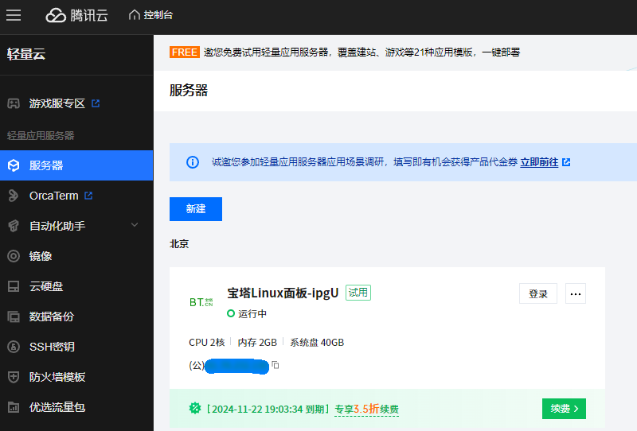
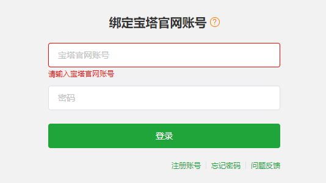

> 在腾讯[云服务器](https://so.csdn.net/so/search?q=云服务器&spm=1001.2101.3001.7020)购买服务器(`试用一个月`)上部署Java服务<Springboot(包含mysql数据库)+Vue项目>
[TOC]

# 一、开通云服务器试用

1.开通试用后进入轻量应用服务器

2.点击详情进入应用管理查看宝塔信息


> 注意事项:
> 1.前往防火墙页面放行8888面板端口
> 2.登录实例执行`sudo /etc/init.d/bt default`命令获取登录用户名及密码

点击登录后会进入腾讯云的orcaterm（可能还会需要你扫描验证身份），执行复制的命令，得到用户名与密码。


> **注意**:首次获取的链接默认的端口是8888，这里为了保护隐私我遮住了。初始密码仅在首次登录面板前能正确获取，其它时间请通过bt5命令修改密码.

>外网面板地址: http://81.70.232.130:8888/tencentcloud
>内网面板地址: http://10.2.20.6:8888/tencentcloud
>username: kph8xicg
>password: 95fd152b5425
>
>远程 +MfZ~8,7wK-T

# 二、安装宝塔插件

1、输入上述账户密码，点击登录后进入这个页面，绑定手机号，`没有宝塔账号先注册之后再来进行绑定`

 

2、安装Nginx及MySQL

登录之后在首页会弹出如下提示框，可`一件安装`或`软件商店`安装软件


上述选择的是`Nginx1.24`、`MySQL8.0`,点击`一建安装`弹出消息盒子：

 

3、在`软件商店`搜索、安装Redis


安装之后可在`软件商店`已安装查看安装插件


点击设置进入Nginx、MySQL及Redis详细页面，可查看或修改配置信息、启用停用、查看日志。

**`重点补充`**:【已解决】腾讯云安装了redis，但是本地访问不到，连接不上。

> 把bind 127.0.0.1给注释掉(前面加#)或者改成bind 0.0.0.0，因为刚下载时它是默认只让本地访问，同时根据自己的需求设置密码。
> systemctl restart redis#配置了之后，重启一下redis。
> sudo iptables -I INPUT -p 【协议】 --dport 【端口号】 -j ACCEPT #不要忘记添加防火墙规则，开放6379端口，编辑完后保存，并且输入systemctl restart iptables，使其生效。

4.查看Ngnix、Mysql软件端口并在腾讯云、宝塔上放行


5、配置Java开发环境


建议不要使用宝塔安装JDK，可采用下述方案下载、安装:

> mkdir /usr/local/java #创建安装目录
> wget https://download.oracle.com/java/21/latest/jdk-21_linux-x64_bin.tar.gz #下载JDK21
> tar -zxvf jdk-21_linux-x64_bin.tar.gz #解压压缩包
> vim /etc/profile #命令编辑环境变量
> #java
> JAVA_HOME=/usr/local/java/jdk-21
> CLASSPATH=$JAVA_HOME/lib/ 
> PATH=$PATH:$JAVA_HOME/bin 
> export PATH JAVA_HOME CLASSPATH
>
> source /etc/profile #命令刷新环境变量

# 三、部署前后端项目

1.上传打包好的后台jar及前端dist


2.创建数据库并远程连接导入SQL文件


3.配置后端项目


确定之后项目则自动启动

 

5.[部署Vue前端](https://doc.ruoyi.vip/ruoyi-app/document/hjbs.html)

通常情况下 `dist` 文件夹的静态文件发布到你的 nginx 或者静态服务器即可，其中的 `index.html` 是后台服务的入口页面。

如果是`H5`部署，推荐通过[Nginx代理配置](https://doc.ruoyi.vip/ruoyi-app/document/hjbs.html#nginx配置)。将`config.js`的`baseUrl`换成`/prod-api`。

```
worker_processes  1;

events {
    worker_connections  1024;
}

http {
    include       mime.types;
    default_type  application/octet-stream;
    sendfile        on;
    keepalive_timeout  65;

    server {
        listen       80;
        server_name  localhost;
		charset utf-8;

		location / {
			root   /home/ruoyi/projects/ruoyi-h5;
			try_files $uri $uri/ /index.html;
            index  index.html index.htm;
        }
		
		# 默认所有路径
        location /prod-api/ {
            proxy_set_header Host $http_host;
            proxy_set_header X-Real-IP $remote_addr;
            proxy_set_header REMOTE_HOST $remote_addr;
            proxy_set_header X-Forwarded-For $proxy_add_x_forwarded_for;
			proxy_set_header X-Forwarded-Proto $scheme;
			proxy_set_header X-NginX-Proxy true;
			
            # 反向代理配置
            proxy_pass http://localhost:8080/;
        }
		
        error_page   500 502 503 504  /50x.html;
        location = /50x.html {
            root   html;
        }
    }
}
```


下载和安装[Xshell和Xftp](https://www.xshell.com/zh/free-for-home-school/)


