!> [CRMEB Java单商户商城系统](https://doc.crmeb.com/java/crmeb_java/2024)：基于java + vue + uniapp 开发的一套 CRMEB 新零售商城系统。 

## 一、账户资金
1、资金说明  
账户余额 = 用户充值金额 + 后台充值金额  
佣金 = 推广员推广收入  

2、规则说明  
(1)余额不可提现，佣金可申请提现  
(2)佣金可通过 “余额充值” 的方式转入余额    
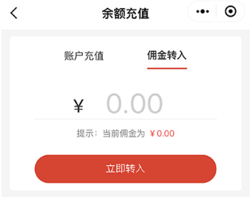

## 二、提现业务逻辑
1.小程序端：我的→当前佣金或分销推广，点击“立即提现”，选择提现方式输入提现金额提交   
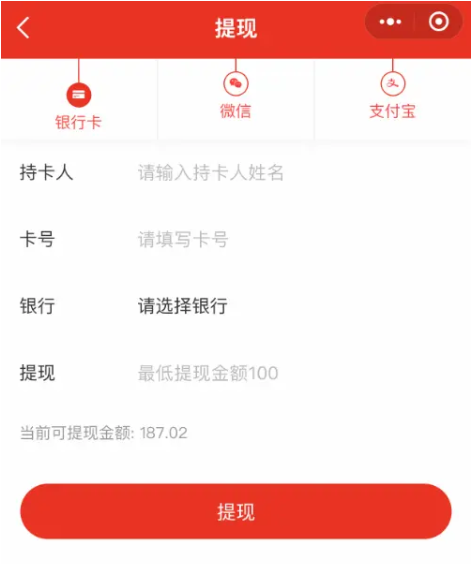  
2.等待后台系统财务审核，线下打款    
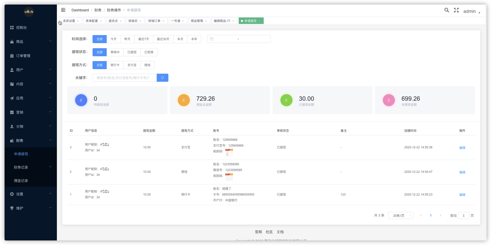
  
!>CRMEB提现相关规则：  
1.可提现的只能为推广佣金。（用户充值的金额、系统后台充值的金额等不可提现）。  
2.用户发起提现后，系统将自动扣除用户相应佣金及余额。  
3.用户发起提现后，需管理后台审核（财务→财务操作→申请提现）。  
4.系统为线下`手动打款`。后台审核提现通过后，需管理人员根据用户提交的账户，线下进行手动打款操作。  
5.如管理后台选择拒绝用户提现，系统将自动返还提现金额至用户账户。  
6.如需自动打款，可联系CRMEB进行二次二开。

## 三、微信小程序订阅消息
选择服务类目：`生活服务>百货/超市/便利店(类目一样的情况下默认模版可以使用`  
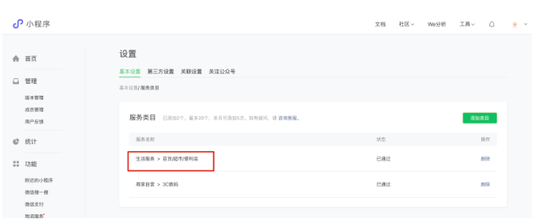  
确认类目不能错误，否则默认通知模版无法使用  
进入微信公众平台、小程序后台：功能->订阅消息。（如未开通，点击申请即可开通)小程序订阅消息  
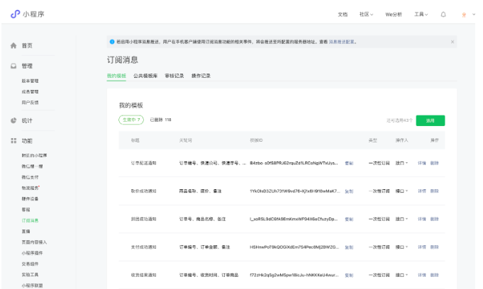  
管理系统查看消息通知列表  
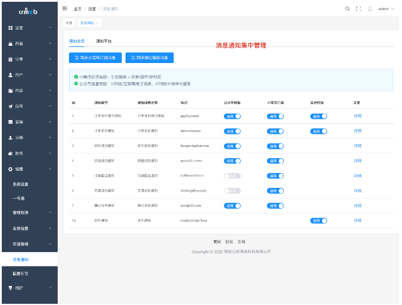  
根据模版编号或者名称，在微信公众平台模版库中搜索模版，如下图所示在对应表中更新模板id即可，保证复制粘贴的正确性，错了发不出通知哦  
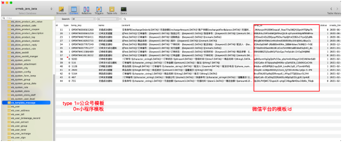

!>注意：
因每个小程序对应的类型不一致，且微信通知模板会不定期更新，需要根据自身业务选择对应业务场景的模板。  
更新上图表中对应的微信模板id 后再对比模板内容，参数对不上的情况下，需要根据ID查询使用模板的业务代码更改对应参数。

## 四、微信支付配置
必须申请开通微信支付  
[百度经验](https://jingyan.baidu.com/article/e5c39bf5e4eb2439d760339f.html) 

### 1.[登录微信商户平台](https://pay.weixin.qq.com/)，点击产品中心→开发配置，复制记录商户号  
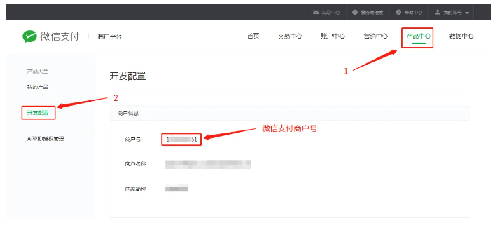  

### 2.添加支付授权域名目录 这里授权的是H5域名  
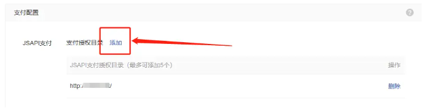    
>注意:这里授权的是H5域名且付授权域名格式：http://域名/

### 3.若提示没有安装证书，请安装证书。

### 4.配置API安全，点击账户中心→API安全—申请API证书  
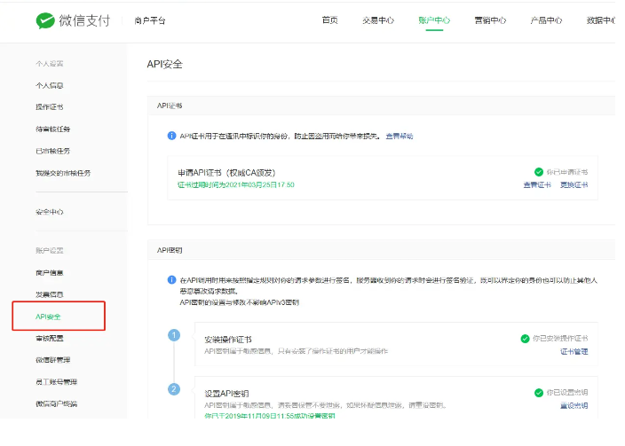  

### 5.生成API证书，下载证书工具  
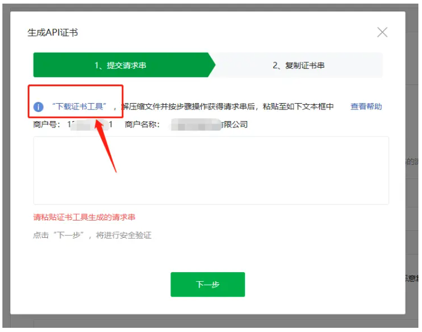 

### 6.对照检查商户号和商户名称是否为你当前配置帐号信息，确定无误后点击“下一步”  
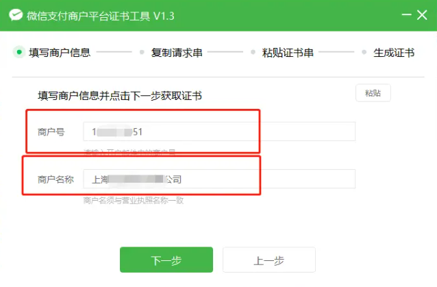 

### 7.点击工具右侧“复制”  
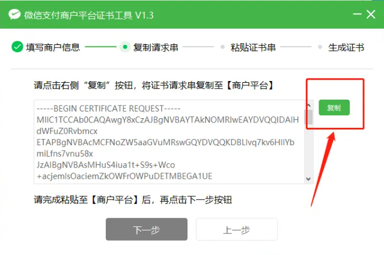 

### 8.切换至浏览器，粘贴，点击下一步  
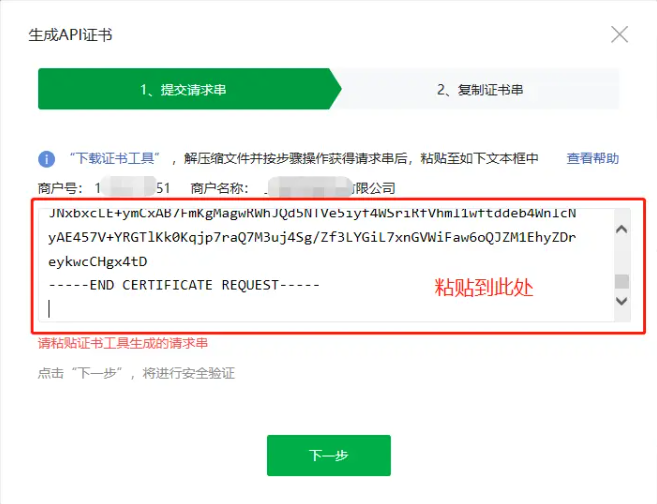 

### 9.复制证书串,切换至证书工具，粘贴，点击下一步  
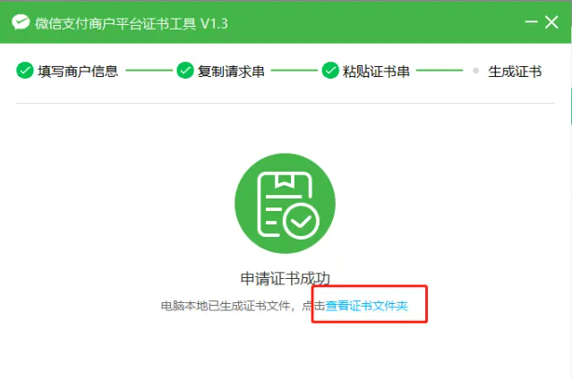

### 10.查看证书文件夹（如遇到360等阻止，点击允许）。证书为 _cert.zip结尾,解压如下图所示  
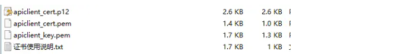

### 11.配置API秘钥，点击设置秘钥  
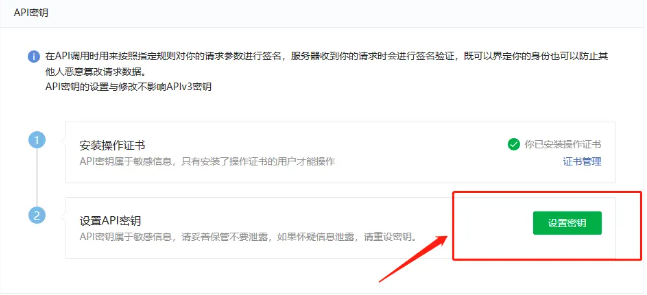  
>设置秘钥，包含随机大小写字母、数字组合，32位。（记得保存）不会的可以在https://suijimimashengcheng.51240.com里选择32位，随机生成，然后复制，在过来粘贴。

### 12.登录CRMEB系统，点击菜单设置→系统设置→支付配置→小程序支付配置  
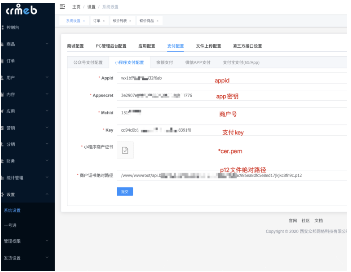

## 五、一号通账户
>**什么是一号通？**  
一号通是CRMEB系统后台内置集成服务平台：  
只需简单注册，开通之后您将享受：发送短信，商品采集，查询快递，电子面单打印多项服务。 

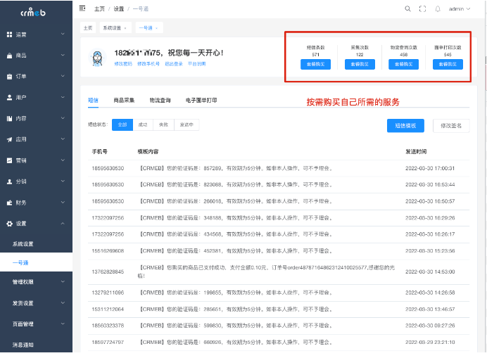

1.小票打印配置  
CRMEB系统已内置小票打印系统，具体支持的打印机型号为:易联云K4无线版，设备购买可在第三方平台或者CRMEB官方商城购买都可以。  
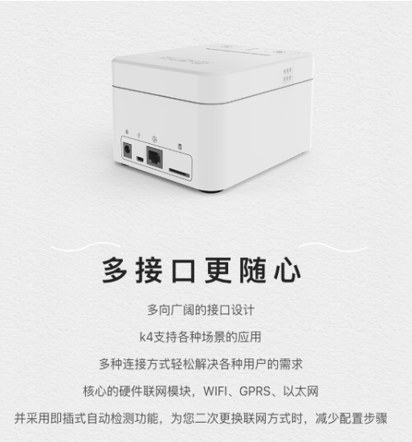

易联云开发者申请[入口](https://dev.10ss.net/)，在应用列表申请-自有型应用服务类型-应用在应用列表申请(申请自有型应用)  
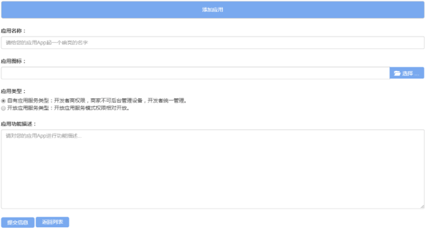   
点击添加就会提示添加成功，点击应用列表查看”用户ID”、 “应用ID”、”应用密钥”。  
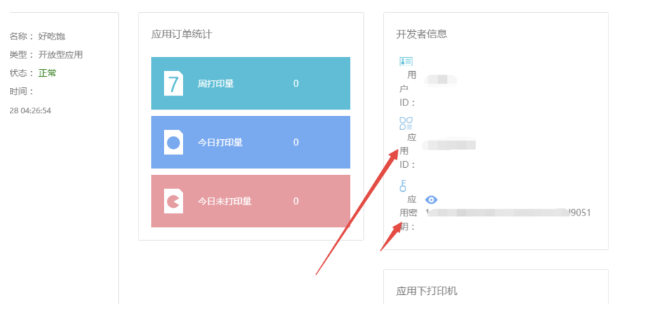  

登陆crmeb系统后台，设置管理→系统设置→第三方接口配置-小票打印设置，填写相关信息，提交。WEB PC配置小票打印。  
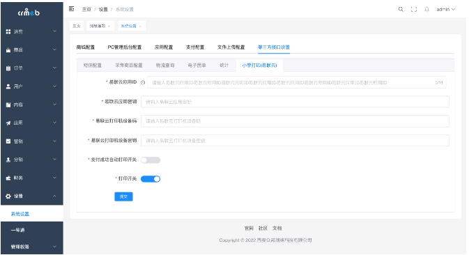  
>注：终端号在打印机的底部。

**易联云打印机**  
用途：用于下单时的小票打印功能  
型号：易联云打印机 K4无线版  
购买：[点击京东购买](https://detail.tmall.com/item.htm?spm=a1z10.1-b.w5003-22075095432.3.76d66964fIqkdW&id=602929097579&sku_properties=5919063:6536025&scene=taobao_shop)  
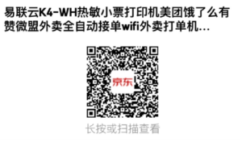  

**电子面单打印机**  
用途：下单时自动打印快递面单，需要开通一号通服务后使用  
型号：快递100云打印机二代3寸 电脑WiFi两用  
购买：[点击京东购买](https://detail.tmall.com/item.htm?spm=a1z10.1-b.w5003-22075095432.3.76d66964fIqkdW&id=602929097579&sku_properties=5919063:6536025&scene=taobao_shop)  
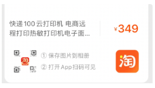  

## 六、分销规则说明
>**CRMBE分销说明**    
注意：能成功绑定分销关系的前提是，必须是具有分销权限的账号。  
通过扫描分销码，绑定分销关系。  
商品分享，在已开通分销权限的前提下，对方打开链接并成功登录后绑定分销关系。  
订单状态必须是已完成之后才会触发分拥流程。  
计算佣金的任务一天执行一次，如果有需要可以自行更改。  
  
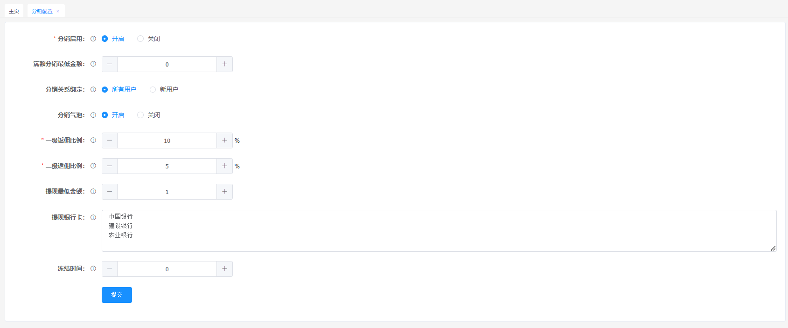 
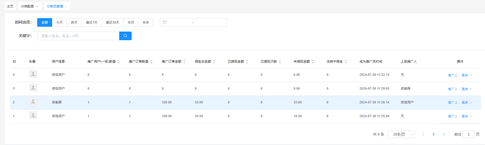 

### 1.CRMEB分销模式及等级
分销模式：取消了人人分销的概念，默认就是指定分销。也可以设置分销门槛让新分销员满足条件后自动成为分销员。    
CRMEB分销为二级分销；`分销固定两级`，后台不能自己设置分销等级。  

### 2.返佣规则
A推广B，B推广了C；  
A购买商品后，自己没有返佣；  
B购买商品后，A获得一级返佣；  
C购买了商品，B获得一级返佣，A获得二级返佣。  
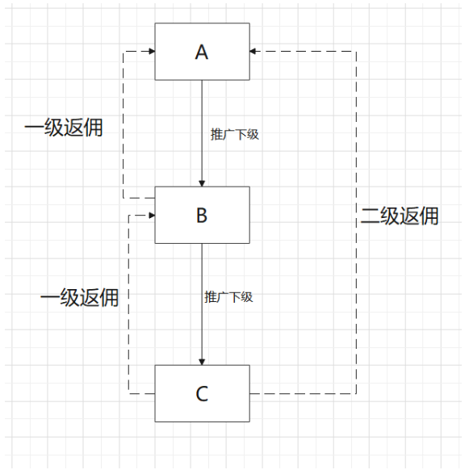  

### 3.商品返佣
商品返佣分为 “默认返佣“ 和 “商品单独返佣“  
`默认返佣`：  
商城统一设置商品的返佣比例  
一级佣金 = 产品成交价 * 一级返佣比例  
二级佣金 = 产品成交价 * 二级返佣比例  
`商品单独返佣`：  
（1）每个商品可选择单独设置返佣  
（2）每个商品规格设置一二级返佣  
（3）单独设置后，商品的返佣以固定佣金为准，不受其他因素影响。  

### 4.佣金冻结
佣金新增冻结期限，后台可设置冻结期，冻结的佣金不可提现，达到解冻时间后方可提现。  
冻结期从用户获得返佣时开始计算，冻结期设置为0时，则为无冻结期；冻结时间单位为 “天“。 

### 5.绑定推广关系说明
小程序：商品详情页(分享链接方式)，产品海报(二维码分享)，分销推广海报(二维码分享)；  
说明：用户通过这些方式进入商城后，必须授权或者注册（H5）之后才会绑定关系。  
当用户已有上级、用户进入商城未授权或注册、用户已经是推广员（指定分销模式），不能绑定推广关系；用户之前访问过商城，但没有上级时，可以绑定推广关系。
>注：用户之间的上下级关系解除之后，推广员之前记录的推广订单依然保留，之后下级消费的订单因推广关系已解除所以不再记录。

参考链接
[[CRMEB Java单商户商城系统]](https://doc.crmeb.com/java/crmeb_java/2024)