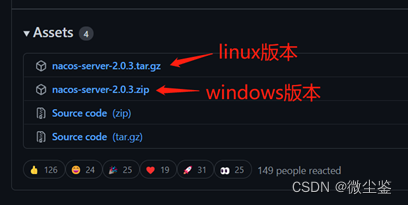
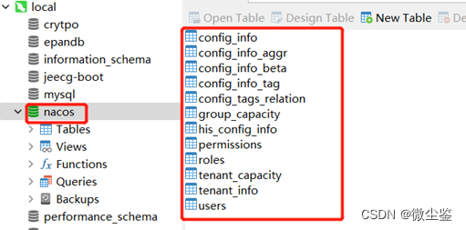
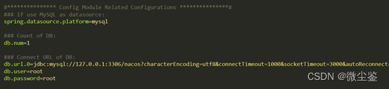
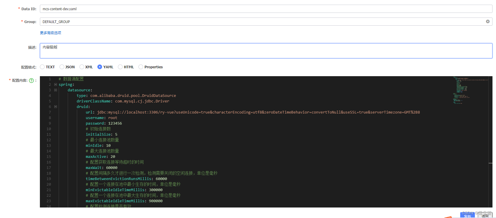
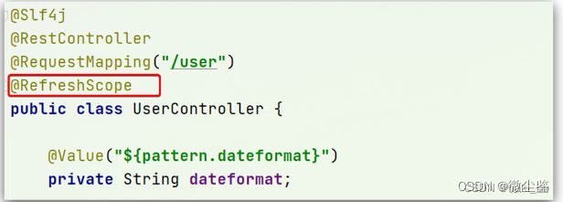
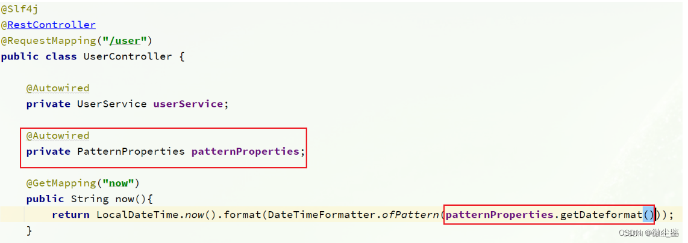

## 一、Nacos 安装
### 1.1  Nacos 服务端下载
下载地址：https://github.com/alibaba/nacos/releases


### 1.2 初始化数据库
在Navicat创建nacos库并执行sql脚本/nacos/conf下nacos-mysql.sql脚本



修改Nacos配置文件，在application.properties中取消注释并修改数据库信息为实际的数据库信息后保存。其他nacos服务实例也需要做同样的修改。

### 1.3 Nacos 单例启动
单实例部署不适合生产环境，单点故障是致命的。
单实例非集群模式启动命令：```startup.sh -m standalone ```
访问 nacos 管理页面，初始化用户名密码均为 nacos
访问地址：http://127.0.0.1:8848/nacos/index.html
## 二、引入Nacos pom.xml文件
```javascript
<dependency>
   <groupId>com.alibaba.cloud</groupId>
   <artifactId>spring-cloud-starter-alibaba-nacos-config</artifactId>
    <version>2.2.5.RELEASE</version>
</dependency>
<dependency>
  <groupId>com.alibaba.cloud</groupId>
  <artifactId>spring-cloud-starter-alibaba-nacos-discovery</artifactId>
    <version>2.2.5.RELEASE</version>
</dependency>
```
## 三、将配置文件迁移Nacos中
先在Nacos中创建命名空间，命名空间ID及命名空间以mcs为例，然后进行项目各服务模块配置文件设置：

配置文件改为bootstrap.yml并修改配置文件如下：
```javascript
spring:
  application:
    name: mcs-content
  profiles:
    active: dev
  cloud:
    nacos:
      discovery:
        namespace: mcs
        server-addr: 127.0.0.1:8848
        group: DEFAULT_GROUP
      config:
        server-addr: 127.0.0.1:8848  #Nacos作为配置中心地址
        namespace: mcs
        prefix: ${spring.application.name}
        file-extension: yaml #指定yaml格式的配置
        group: DEFAULT_GROUP
  ```
  
先根据spring.cloud.nacos.server-addr获取nacos地址，再根据作为文件id```(mcs-content-dev.yaml)```来读取配置。
其实微服务启动时，会去nacos读取多个配置文件，例如：
[spring.application.name]-[spring.profiles.active].yaml，例如：mcs-content-dev.yaml
[spring.application.name].yaml，例如：mcs-content.yaml
```而[spring.application.name].yaml不包含环境，因此可以被多个环境共享。```

若application.yml和bootstrap.yml在同⼀⽬录下，则bootstrap.yml的加载顺序要⾼于application.yml。
•bootstrap.yml 用来程序引导时执行，应用于更加```早期配置信息```读取，如可以使用来配置application.yml中使用到参数等。
•application.yml 应用程序特有配置信息，可以用来配置后续各个模块中需使用的公共参数等、可以⽤来定义应⽤级别的，如果搭配spring-cloud-config 使⽤ application.yml ⾥⾯定义的⽂件可以实现动态替换。
使用springCloud的时候,配置信息一般是要从configServer加载的,为了取到配置信息,需要更早的取到配置,引导配置,因此把config server信息放在bootstrap.yml,用来加载真正需要的配置信息。[^1]
## 四、统一服务名称
将SpringCloud注册中心由Eureka迁移到Nacos，但是Nacos服务端及Nacos客户端对服务名称的支持是```区分大小写```的，即从Eureka同步到Nacos中的大写服务名称，通过Feign中使用小写的服务名称调用时，就会报找不到服务的错误。
```spring.cloud.gateway.discovery.locator.lower-case-service-id=true```
是将请求路径上的服务名配置为小写，因为服务注册的时候，向注册中心注册时将服务名转成大写的了。
```spring.cloud.gateway.discovery.locator.enabled=false```
是否与服务发现组件进行结合，通过 serviceId 转发到具体的服务实例。
默认为false，设为true便开启通过服务中心的自动根据 serviceId 创建路由的功能，并且路由配置失效。

## 五、热部署配置
最终的目的，是修改nacos中的配置后，微服务中无需重启即可让配置生效，也就是配置热更新。
要实现配置热更新，可以使用两种方式
①在@Value注入的变量所在类上添加注解@RefreshScope：


②使用@ConfigurationProperties注解代替@Value注解。
在mcs-content服务中，添加一个类，读取patterrn.dateformat属性：
```javascript
import lombok.Data;
import org.springframework.boot.context.properties.ConfigurationProperties;
import org.springframework.stereotype.Component;
 
@Data
@Component
@ConfigurationProperties(prefix = "pattern")
public class PatternProperties {
    private String dateFormat;
}
```


根据上述的两种方式都可以达到nacos配置修改热部署的效果，因为@Value需要配置@RefreshScope才可以实现效果，而@ConfigurationProperties就可以达到相同的效果，则推荐使用方式二。