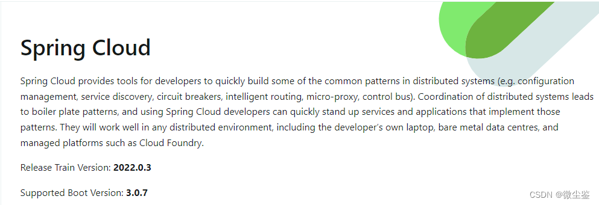
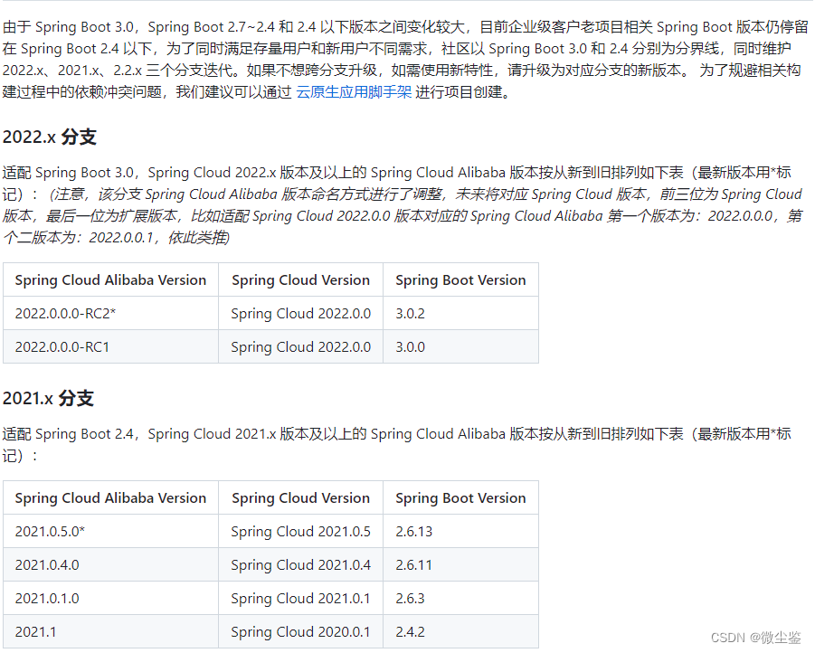
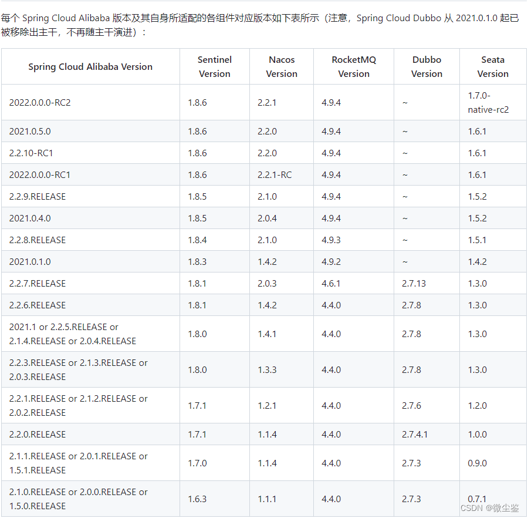
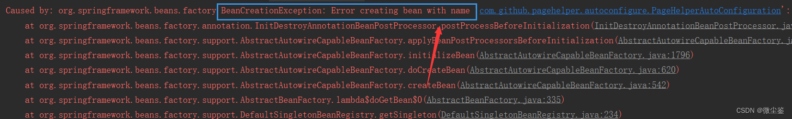

## 前言
基于Spring Cloud 2022.0.0和Spring Boot 3.0，适配了生态中原有的注册配置中心、分布式消息等诸多组件，属于大改版。 本次发布的Spring Cloud Alibaba 2022.0.0.0-RC1版本适配了以下组件版本：
Seata：客户端适配版本为 1.6.1 版本 ，该版本相比于之前的1.5.x版本，已经支持MySQL updatejoin，PostgreSQL & Oracle多主键支持，InsertOnDuplicateUpdate 做了大量优化，支持多注册中心等及核心功能大量优化，该版本客户端已完成JDK17的支持。
RocketMQ：客户端适配版本为4.9.4版本，提供轻量级消息队列、延迟消息异步发送功能等诸多特性。
Sentinel：客户端适配版本为1.8.6版本。 该版本调整了Sentinel规则类中的属性，将javax.*包下的相关基础类替换为jakarta.*包路径下的类。 与 JDK 17 兼容。
Nacos：客户端适配版本为2.2.1-RC。 该版本是Nacos社区基于最新2.2.0版本推出的最新版客户端，适配最新的GraalVM，构建原生镜像。 该版本可直接搭配使用Nacos 2.x系列中的Nacos Server，不仅可以体验2.2.0带来的数据源、连接限流等插件能力，还可以直接构建GraalVM原生镜像， 这大大降低了启动速度和运行时内存。
除了组件升级，还修复了之前版本存在的一些问题，进一步提升了Spring Cloud Alibaba的稳定性和健壮性。 更多信息请参考本版本相关发布公告。
## 一、查看推荐版本及组件版本
### 1.1、[SpringCloud官方文档](https://spring.io/projects/spring-cloud)

### 1.2、[Spring Cloud Alibaba Wiki文档](https://github.com/alibaba/spring-cloud-alibaba/wiki)
Spring Cloud Alibaba 致力于提供微服务开发的一站式解决方案。此项目包含开发分布式应用服务的必需组件，方便开发者通过 Spring Cloud 编程模型轻松使用这些组件来开发分布式应用服务。依托 Spring Cloud Alibaba，您只需要添加一些注解和少量配置，就可以将 Spring Cloud 应用接入阿里分布式应用解决方案，通过阿里中间件来迅速搭建分布式应用系统。
#### 1.2.1、毕业版本依赖关系(推荐使用)

#### 1.2.2、组件版本关系

### 1.3、[Maven仓库官网](https://mvnrepository.com/)|[JAR仓库官网](https://repo1.maven.org/maven2/)
## 二、升级异常问题处理
### 2.1、Servlet版本变更
Tomcat10中的javax.servlet-api 已变成 jakarta.servlet-api，依赖不匹配会导致服务器无法实例化servlet类，解决方法是将pom.xml里javax.servlet-api依赖变更为jakarta.servlet-api依赖。
```bash
<dependency>
    <groupId>jakarta.servlet</groupId>
   <artifactId>jakarta.servlet-api</artifactId>
   <version>5.0.0</version>
   <scope>provided</scope>
 </dependency>
```
可到https://mvnrepository.com/上搜索jakarta servlet选择最新版本。
### 2.2、bootstrap.yml配置生效
单纯的springboot项目只会识别application.* 文件
因此可以修改配置文件的名字，也可以将项目变为springcloud项目。
springcloud项目能够识别bootstrap.yml  bootstrap.properties
新增依赖将springboot变成springcloud就可以了
```bash
<dependency>
   <groupId>org.springframework.cloud</groupId>
   <artifactId>spring-cloud-starter-bootstrap</artifactId>
 </dependency>
```
### 2.3、更新到springdoc
>特别提醒：建议使用springfox升级到springdoc，springdoc是支持OPENAPIV3进行实现了；很好用，毕竟springfox已经好多年都不维护了，强烈建议更新到springdoc，更新比较简单，官网：GitHub - springdoc/springdoc-openapi: Library for OpenAPI 3 with spring-boot
>
其实网上已经有了，通过
`spring.mvc.pathmatch.matching-strategy=ant_path_matcher`
就可以了，这个我之前就这么用的，最近springboot版本升级到2.7.4了，也顺带了解了下springboot3.0版本升级事项，目前pathmatch 这个配置虽然在3.0也保留了。

### 2.4、Quartz依赖变更
1、问题描述
`java.sql.SQLException: There is no DataSource named 'null'`

2、问题原因
SpringBoot在2.5.6版本之后就删除了关于Quartz相关的以来。所以在2.5.6版及之前还是可以用的。

3、解决办法
将quatz.propeties文件中
`org.quartz.jobStore.class=org.quartz.impl.jdbcjobstore.JobStoreTX`
改为
`org.quartz.jobStore.class=org.springframework.scheduling.quartz.LocalDataSourceJobStore`
### 2.5、跨域配置变更
1、问题描述
SpringBoot配置跨域时出现：
`java.lang.IllegalArgumentException: When allowCredentials is true, allowedOrigins cannot contain the special value "*"since that cannot be set on the "Access-Control-Allow-Origin" response header. To allow credentials to a set of origins, list them explicitly or consider using "allowedOriginPatterns" instead.`

2、问题原因
SpringBoot升级2.4.0之后，跨域配置中的.allowedOrigins不再可用

3、解决办法
将配置中的.allowedOrigins替换成.allowedOriginPatterns即可。
```java
@Configuration
public class CorsConfig implements WebMvcConfigurer {
    @Override
    public void addCorsMappings(CorsRegistry registry) {
        registry.addMapping("/**").allowedOriginPatterns("*")
                .allowedMethods("GET", "HEAD", "POST","PUT", "DELETE", "OPTIONS")
                .allowCredentials(true).maxAge(3600);
    }
}
```
### 2.6、分页PageHelper设置
1、问题描述
Springboot配置分页PageHelper出现Error creating bean with name 'com.github.pagehelper.autoconfigure.PageHelperAutoConfiguration'


2、问题原因
springboot在版本2点几进行配置pageHelper会报错，原因是springboot2.6+版本默认禁止循环依赖

3、解决办法

解决办法一：在启动类上添加注解
@SpringBootApplication(exclude = {PageHelperAutoConfiguration.class})

解决办法二：在配置文件yml中进行配置
spring.main.allow-circular-references=true

## 三、MyBatis升级MyBtaisPlus
1、Mybatis配置文件
MyBatis - Could not resolve type alias ‘XXX‘（实体类全局别名）
```java
mybatis-plus:
  mapper-locations: classpath:mapper/**.xml
  type-aliases-package: com.luxsun.project.entity
```
2、实体常用配置
```java
@TableName("rp_news_iformation")
public class RpNewsIformation{}
@TableId(value = "id",type = IdType.AUTO)
private String id;
@TableLogic
private String delFlag;
@TableField(exist=false)
private String searchValue;
```
3、基础DAO层
```java
/**
 * 基础DAO类，继承BaseMapper实现常用的CRUD功能，同步加上分页查询
 * @param <T>
 */
public interface BaseDao<T>  extends BaseMapper<T> {

    /**
     * 分页查询
     * @param page
     * @param params
     * @return
     */
    IPage<T> query(IPage<T> page, @Param("w") Map<String, Object> params,@Param("key") String key);


    /**
     * 根据条件查询
     * @param params
     * @return
     */
    List<T> query(@Param("w") Map<String, Object> params);
}
```
4、Mapper文件
```java
@Mapper
public interface RpNewsIformationMapper extends BaseDao<RpNewsIformation> {

    /**
     * 查询工作动态信息列表
     * 
     * @param rpNewsIformation 工作动态信息
     * @return 工作动态信息集合
     */
    public List<RpNewsIformation> selectRpNewsIformationList(RpNewsIformation rpNewsIformation);
}
```
## 四、SpringBoot3整合SpringSecurity
```java
package com.mcs.framework.config;

import org.springframework.beans.factory.annotation.Autowired;
import org.springframework.context.annotation.Bean;
import org.springframework.context.annotation.Configuration;
import org.springframework.http.HttpMethod;
import org.springframework.security.authentication.AuthenticationManager;
import org.springframework.security.authentication.AuthenticationProvider;
import org.springframework.security.authentication.dao.DaoAuthenticationProvider;
import org.springframework.security.config.annotation.authentication.configuration.AuthenticationConfiguration;
import org.springframework.security.config.annotation.method.configuration.EnableMethodSecurity;
import org.springframework.security.config.annotation.web.builders.HttpSecurity;
import org.springframework.security.config.annotation.web.configuration.WebSecurityCustomizer;
import org.springframework.security.config.http.SessionCreationPolicy;
import org.springframework.security.core.userdetails.UserDetailsService;
import org.springframework.security.crypto.bcrypt.BCryptPasswordEncoder;
import org.springframework.security.web.SecurityFilterChain;
import org.springframework.security.web.authentication.UsernamePasswordAuthenticationFilter;
import org.springframework.security.web.authentication.logout.LogoutFilter;
import org.springframework.web.filter.CorsFilter;
import com.mcs.framework.security.filter.JwtAuthenticationTokenFilter;
import com.mcs.framework.security.handle.AuthenticationEntryPointImpl;
import com.mcs.framework.security.handle.LogoutSuccessHandlerImpl;

/**
 * spring security配置
 * 
 * @author ruoyi
 */
@Configuration
@EnableMethodSecurity
public class SecurityConfig {

	/**
	 * 自定义用户认证逻辑
	 */
	@Autowired
	private UserDetailsService userDetailsService;

	/**
	 * 认证失败处理类
	 */
	@Autowired
	private AuthenticationEntryPointImpl unauthorizedHandler;

	/**
	 * 退出处理类
	 */
	@Autowired
	private LogoutSuccessHandlerImpl logoutSuccessHandler;

	/**
	 * token认证过滤器
	 */
	@Autowired
	private JwtAuthenticationTokenFilter authenticationTokenFilter;

	/**
	 * 跨域过滤器
	 */
	@Autowired
	private CorsFilter corsFilter;

	@Bean
	public AuthenticationManager authenticationManager(AuthenticationConfiguration config) throws Exception {
		return config.getAuthenticationManager();
	}

	@Bean
	public SecurityFilterChain filterChain(HttpSecurity httpSecurity) throws Exception {
		httpSecurity
				// CSRF禁用，因为不使用session
				.csrf().disable()
				// 认证失败处理类
				.exceptionHandling().authenticationEntryPoint(unauthorizedHandler).and()
				// 基于token，所以不需要session
				.sessionManagement().sessionCreationPolicy(SessionCreationPolicy.STATELESS).and()
				// 过滤请求
				.authorizeHttpRequests()
				// 对于登录login 注册register 验证码captchaImage 允许匿名访问
				.requestMatchers("/login", "/register", "/captchaImage").anonymous()
				.requestMatchers(HttpMethod.GET, "/", "/*.html", "/**/*.html", "/**/*.css", "/**/*.js", "/profile/**")
				.permitAll().requestMatchers("/swagger-ui.html").anonymous().requestMatchers("/swagger-resources/**")
				.anonymous().requestMatchers("/webjars/**").anonymous().requestMatchers("/*/api-docs").anonymous()
				.requestMatchers("/druid/**").anonymous()
				// 除上面外的所有请求全部需要鉴权认证
				.anyRequest().authenticated().and().headers().frameOptions().disable();
		httpSecurity.logout().logoutUrl("/logout").logoutSuccessHandler(logoutSuccessHandler);
		// 添加JWT filter
		httpSecurity.addFilterBefore(authenticationTokenFilter, UsernamePasswordAuthenticationFilter.class);
		// 添加CORS filter
		httpSecurity.addFilterBefore(corsFilter, JwtAuthenticationTokenFilter.class);
		httpSecurity.addFilterBefore(corsFilter, LogoutFilter.class);
		return httpSecurity.build();
	}

	@Bean
	public BCryptPasswordEncoder bCryptPasswordEncoder() {
		return new BCryptPasswordEncoder();
	}

	@Bean
	public AuthenticationProvider authenticationProvider() {
		DaoAuthenticationProvider authProvider = new DaoAuthenticationProvider();
		authProvider.setUserDetailsService(userDetailsService);
		authProvider.setPasswordEncoder(bCryptPasswordEncoder());
		return authProvider;
	}

	@Bean
	public WebSecurityCustomizer webSecurityCustomizer() {
		return (web) -> web.ignoring().requestMatchers("/images/**", "/js/**", "/webjars/**");
	}
}
```

## 五、[参考项目](https://gitee.com/IElwin/ezlcp-java/tree/master)及POM配置文件
```java
<?xml version="1.0" encoding="UTF-8"?>
<project xmlns="http://maven.apache.org/POM/4.0.0" xmlns:xsi="http://www.w3.org/2001/XMLSchema-instance" xsi:schemaLocation="http://maven.apache.org/POM/4.0.0 http://maven.apache.org/xsd/maven-4.0.0.xsd">
  <modelVersion>4.0.0</modelVersion>

  <groupId>com.mcs</groupId>
  <artifactId>mcs</artifactId>
  <version>0.0.1-SNAPSHOT</version>
  <packaging>pom</packaging>

  <name>mcs</name>
  <url>http://maven.apache.org</url>
  
   <properties>
       <ruoyi.version>3.7.0</ruoyi.version>
       <project.build.sourceEncoding>UTF-8</project.build.sourceEncoding>
       <project.reporting.outputEncoding>UTF-8</project.reporting.outputEncoding>
       <java.version>1.8</java.version>
       <maven-jar-plugin.version>3.1.1</maven-jar-plugin.version>
       <spring-boot.version>3.0.7</spring-boot.version>
       <spring-alibaba.version>2022.0.0.0-RC2</spring-alibaba.version>
       <spring-cloud.version>2022.0.3</spring-cloud.version>
       <mybatis-plus.version>3.5.3.1</mybatis-plus.version>
       <mybatis.version>3.5.11</mybatis.version>
       <pagehelper.boot.version>1.4.7</pagehelper.boot.version>
       <druid.version>1.2.18</druid.version>
       <mysql.version>8.0.30</mysql.version>
       <nacos.version>2.2.5.RELEASE</nacos.version>
       <bitwalker.version>1.21</bitwalker.version>
       <swagger.version>3.0.0</swagger.version>
       <kaptcha.version>2.3.2</kaptcha.version>
       <fastjson.version>1.2.78</fastjson.version>
       <oshi.version>5.8.2</oshi.version>
       <jna.version>5.9.0</jna.version>
       <commons.io.version>2.11.0</commons.io.version>
       <commons.fileupload.version>1.4</commons.fileupload.version>
       <commons.collections.version>3.2.2</commons.collections.version>
       <poi.version>4.1.2</poi.version>
       <velocity.version>1.7</velocity.version>
       <jwt.version>0.9.1</jwt.version>
   </properties>
	
    <!-- 依赖声明 -->
    <dependencyManagement>
        <dependencies>
	        <!--SpringBootCloud -->
            <dependency>
                <groupId>org.springframework.cloud</groupId>
                <artifactId>spring-cloud-dependencies</artifactId>
                <version>${spring-cloud.version}</version>
                <type>pom</type>
                <scope>import</scope>
            </dependency>
             <dependency>
                <groupId>org.springframework.cloud</groupId>
                <artifactId>spring-cloud-starter-bootstrap</artifactId>
                <version>4.0.2</version>
            </dependency>
           <!-- <dependency>
                <groupId>de.codecentric</groupId>
                <artifactId>spring-boot-admin-dependencies</artifactId>
                <version>${spring-boot-admin.version}</version>
                <type>pom</type>
                <scope>import</scope>
            </dependency>-->
            <!-- SpringBoot的依赖配置 -->
            <dependency>
                <groupId>org.springframework.boot</groupId>
                <artifactId>spring-boot-dependencies</artifactId>
                <version>${spring-boot.version}</version>
                <type>pom</type>
                <scope>import</scope>
            </dependency>
            <dependency>
                <groupId>com.alibaba.cloud</groupId>
                <artifactId>spring-cloud-alibaba-dependencies</artifactId>
                <version>${spring-alibaba.version}</version>
                <type>pom</type>
                <scope>import</scope>
            </dependency>
            <!-- mybatis-plus start -->
	        <dependency>
	            <groupId>com.baomidou</groupId>
	            <artifactId>mybatis-plus-boot-starter</artifactId>
	            <version>${mybatis-plus.version}</version>
	        </dependency>
	        <dependency>
	            <groupId>com.baomidou</groupId>
	            <artifactId>mybatis-plus-extension</artifactId>
	            <version>${mybatis-plus.version}</version>
	        </dependency>
	        <dependency>
	            <groupId>com.baomidou</groupId>
	            <artifactId>mybatis-plus</artifactId>
	            <version>${mybatis-plus.version}</version>
	        </dependency>
	        <dependency>
	            <groupId>org.mybatis</groupId>
	            <artifactId>mybatis</artifactId>
	            <version>${mybatis.version}</version>
	        </dependency>
	        <!-- pagehelper 分页插件 -->
            <dependency>
                <groupId>com.github.pagehelper</groupId>
                <artifactId>pagehelper-spring-boot-starter</artifactId>
                <version>${pagehelper.boot.version}</version>
            </dependency>
            <!-- 阿里数据库连接池 -->
            <dependency>
                <groupId>com.alibaba</groupId>
                <artifactId>druid-spring-boot-3-starter</artifactId>
                <version>${druid.version}</version>
            </dependency>
            <!-- Swagger3依赖 -->
            <dependency>
                <groupId>io.springfox</groupId>
                <artifactId>springfox-boot-starter</artifactId>
                <version>${swagger.version}</version>
                <exclusions>
                    <exclusion>
                        <groupId>io.swagger</groupId>
                        <artifactId>swagger-models</artifactId>
                    </exclusion>
                </exclusions>
            </dependency>
            <!-- 阿里JSON解析器 -->
            <dependency>
                <groupId>com.alibaba</groupId>
                <artifactId>fastjson</artifactId>
                <version>${fastjson.version}</version>
            </dependency>
            <!-- 通用工具-->
            <dependency>
                <groupId>com.ruoyi</groupId>
                <artifactId>ruoyi-common</artifactId>
                <version>${ruoyi.version}</version>
            </dependency>
        </dependencies>
    </dependencyManagement>

    <build>
        <plugins>
            <plugin>
                <groupId>org.apache.maven.plugins</groupId>
                <artifactId>maven-compiler-plugin</artifactId>
                <configuration>
                    <source>${java.version}</source>
                    <target>${java.version}</target>
                    <encoding>${project.build.sourceEncoding}</encoding>
                </configuration>
            </plugin>
        </plugins>
    </build>
    <repositories>
		<!-- 由于未正式发版，所以在Maven仓库里还搜不到，需要额外配置一个远程仓库 -->
	    <repository>
	        <id>ossrh</id>
	        <name>OSS Snapshot repository</name>
	        <url>https://oss.sonatype.org/content/repositories/snapshots/</url>
	        <releases>
	            <enabled>false</enabled>
	        </releases>
	        <snapshots>
	            <enabled>true</enabled>
	        </snapshots>
	    </repository>
        <repository>
            <id>public</id>
            <name>aliyun nexus</name>
            <url>https://maven.aliyun.com/repository/public</url>
            <releases>
                <enabled>true</enabled>
            </releases>
        </repository>
    </repositories>

    <pluginRepositories>
        <pluginRepository>
            <id>public</id>
            <name>aliyun nexus</name>
            <url>https://maven.aliyun.com/repository/public</url>
            <releases>
                <enabled>true</enabled>
            </releases>
            <snapshots>
                <enabled>false</enabled>
            </snapshots>
        </pluginRepository>
    </pluginRepositories>

  <modules>
  	<module>mcs-web</module>
  	<module>mcs-common</module>
  	<module>mcs-system</module>
  	<module>mcs-content</module>
  	<module>mcs-minority</module>
  </modules>
</project>
```

