## Canal介绍
!>一般在统计分析功能中，我们会采取Feign服务调用获取统计数据，这样耦合度高，效率相对较低，目前采取另一种实现方式，通过实时同步数据库表的方式实现，例如我们要统计每天注册与登录人数，我们只需把会员表同步到统计库中，实现本地统计就可以了，这样效率更高，耦合度更低，Canal就是一个很好的数据库同步工具。canal是阿里巴巴旗下的一款开源项目，纯Java开发。基于数据库增量日志解析，提供增量数据订阅&消费，目前主要支持了MySQL。  

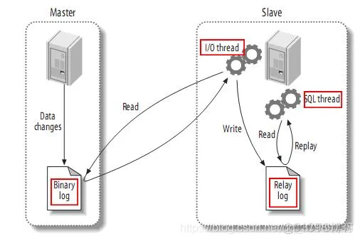  
`canal的原理是基于mysql binlog技术`，所以这里一定需要开启mysql的binlog写入功能。

### 检查是否开启binlog功能
```
show variables like 'log_bin'; -- OFF 表示功能未开启
show variables like '%binlog_format%';
```
binlog记录格式有两种，statement/row，其中statment记录SQL格式，row格式记录每行的变更内容，控制格式的参数有三种，statement/mix/row，其中mix表示两者的混合

### 如何开启binlog功能
配置my.ini，在[mysqld] 下添加：
```
##修改mysql启动配置
vim /etc/my.cnf 
#添加binlog配置
[mysqld]
log-bin=mysql-bin #开启binlog
binlog_format=ROW #选择 ROW 模式
server-id=1000 #配置 MySQL replaction需要定义，不要和canal的slaveId重复。
#重启mysql
restart mysqld
```   

binlog命令行参数详解：  
>log-bin [=file_name] 此参数表示启用binlog日志功能，并可以定制文件名称，默认为mysql-bin。存放目录是mysql安装目录的data文件夹下。  
binlog_format 此参数配置binlog的日志格式，默认为mixed。  
max_binlog_size此参数配置binlog的日志最大值，最大和默认值是1GB。  
max_binlog_cache_size此参数表示binlog使用最大内存的数。  
binlog-do-db=db_name 此参数表示只记录指定数据库的二进制日志。  
binlog-ignore-db=db_name此参数表示不记录指定的数据库的二进制日志。  
expire_logs_days 此参数表示binlog日志保留的时间，默认单位是天。  

进到bin/目录下，执行mysqlbinlog命令查看二进制文件日志：
```
mysqlbinlog ../data/mysql-bin.000001
```
为了方便查看日志内容 可以导出到.sql文件
```
mysqlbinlog ../data/mysql-bin.000001 ->a.sql
```

### 新增相关用户和权限
```
CREATE USER 'canal'@'%' IDENTIFIED BY 'canal';
-- 注意权限问题，否则在后续的一些操作中会提示没有权限
GRANT ALL PRIVILEGES ON *.* TO 'canal'@'%';
FLUSH PRIVILEGES;
```

## 下载安装Canal服务
>推荐canal1.1.5，只需要使用jdk1.8。canal1.1.6，该版本需要使用jdk11+。

### 1）canal角色
canal-admin：canal控制台，可以统一管理canal服务。   
canal-deployer：也是canal-server：canal的一个节点服务。  
canal-instance：canal-server中的一个处理实例，可以处理不同的业务逻辑。  
canal-adaper：canal适配器，canal 1.1.1之后，提供了适配器功能，可将canal server的数据直接输出到目的地，不需要用户编写客户端（个性化需求还需要用户编写客户端实现）  
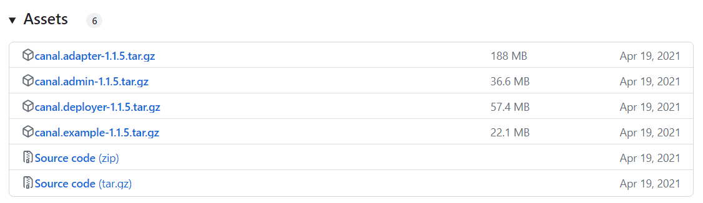
[下载地址：https://github.com/alibaba/canal/releases](https://github.com/alibaba/canal/releases)
```
#进入安装包
cd /opt/canal
#下载admin安装包及deployer安装包
wget https://github.com/alibaba/canal/releases/download/canal-1.1.5/canal.admin-1.1.5.tar.gz
wget https://github.com/alibaba/canal/releases/download/canal-1.1.5/canal.deployer-1.1.5.tar.gz
#创建admin安装目录
mkdir canal-admin
#解压到admin目录
tar zxvf canal.admin-1.1.5.tar.gz -C ./canal-admin
```

### 2）安装canal-admin
#### 执行脚本
SQL脚本位置：conf/canal_manager.sql
脚本中是单独创建了一个数据库canal_manager，我们也可以不单独创建数据库，与其他业务表放在一起

#### 替换mysql connector
因为我是用的mysql8.0，而canal-admin中默认提供的驱动器是mysql5.0的，因此要替换一下（canal-admin解压目录的lib文件夹），同时确认是否需要授权（Linux下可能需要有权限）
下载地址：https://dev.mysql.com/downloads/connector/j/  
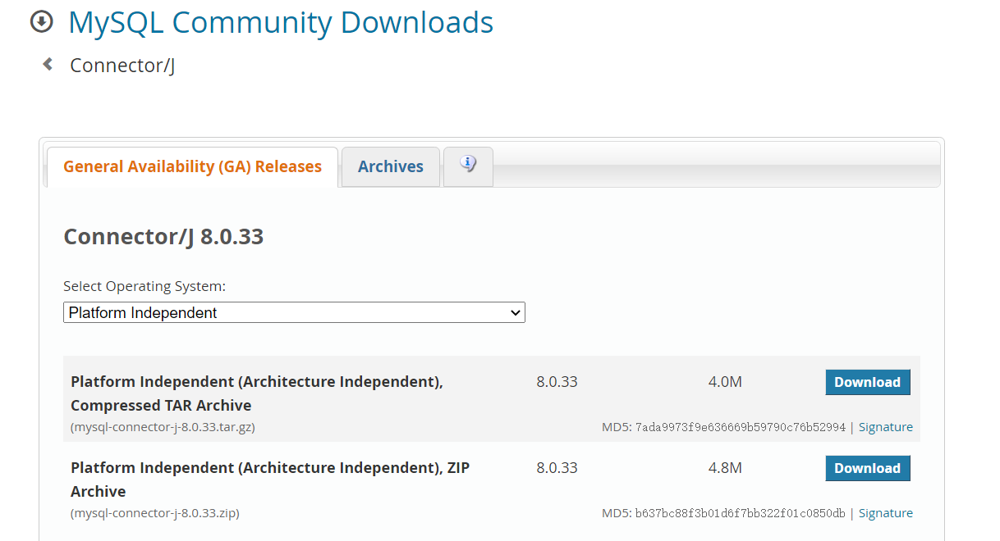

#### 修改配置文件
conf/application.yml
修改内容：
```
server:
  port: 8089
spring:
  jackson:
    date-format: yyyy-MM-dd HH:mm:ss
    time-zone: GMT+8

spring.datasource:
  address: 127.0.0.1:3306
  database: test
  username: canal
  password: canal
  driver-class-name: com.mysql.jdbc.Driver
  url: jdbc:mysql://${spring.datasource.address}/${spring.datasource.database}?useUnicode=true&characterEncoding=UTF-8&useSSL=false
  hikari:
    maximum-pool-size: 30
    minimum-idle: 1

#canal admin账号和密码
canal:
  adminUser: admin
  adminPasswd: 123456
```

#### 启动
点击bin/startup.bat
```
2023-06-17 13:53:04.350 [main] INFO  com.alibaba.otter.canal.admin.CanalAdminApplication - Started CanalAdminApplication in 4.537 seconds (JVM running for 5.09)
```
启动成功后，访问：http://127.0.0.1:8089/，输入默认账号admin/123456
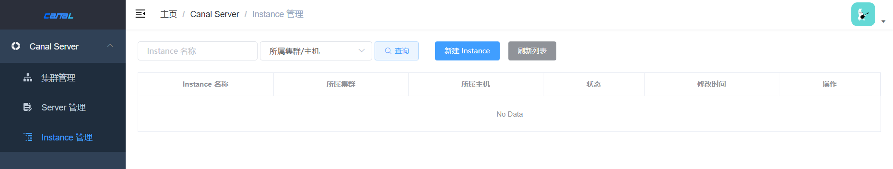

#### 集群管理
在集群管理中，点击新建集群，新建一个集群配置。这里的zk地址就是服务端集群的zk地址。
Canal的集群原理是指如何将多个Canal节点组成一个集群,以提高系统的可用性和扩展性。
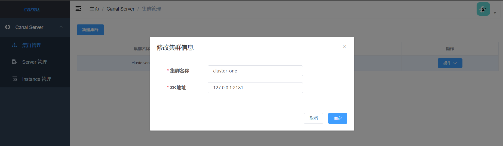

`注意：如果数据库的canal用户权限受限，是无法成功保存集群信息的，此时需要为canal用户重新授权，并重新启动canal-admin。`

### 3）服务端deployer配置
下载canal-deployer，解压。

#### 替换mysql connector
因为我是用的mysql8.0，而canal-admin中默认提供的驱动器是mysql5.0的，因此要替换一下（canal-deployer解压目录的lib文件夹）

#### 修改配置文件
在conf目录下，备份canal.properties，将canal_local.properties重命名为canal.properties。  
修改内容：
```
# 当前节点ip
canal.register.ip = 127.0.0.1

# admin的地址和账号密码
canal.admin.manager = 127.0.0.1:8089
canal.admin.port = 11110
canal.admin.user = admin
# admin密码，使用了mysql的password加密后的密码，与admin的conf/applicaiton.yml中设置的密码对应
canal.admin.passwd = 6BB4837EB74329105EE4568DDA7DC67ED2CA2AD9

# 开启自动注册模式
canal.admin.register.auto = true
# 指定注册的集群名
canal.admin.register.cluster = cluster-one
# 注册到admin上的服务名，默认为当前ip
canal.admin.register.name = server-01
```
如果要调整admin密码，可以通过如下mysql指令设置：
```
# mysql5.0
select password('xxx')

# mysql8.0
select upper(sha1(unhex(sha1('xxx'))))
```
#### 启动服务
```
bin/startup.sh local #启动服务 以canal_local.properties 配置方式
tailf logs/canal/canal.log #查看启动日志
```

#### 管理端admin配置
一般情况server启动后会自动注册到admin中。
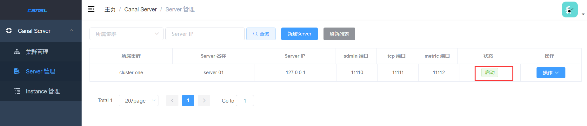  
如果没有自动注册的话，就点击“新建Server”手动添加一下
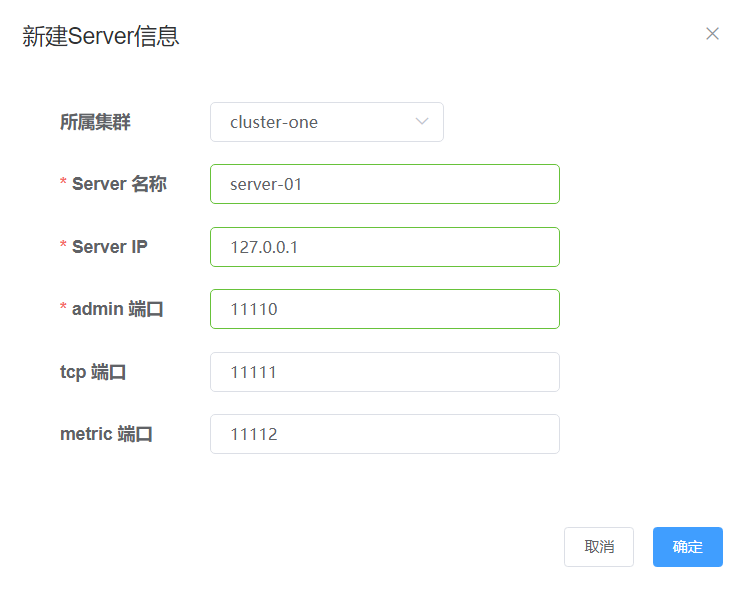  
之后我们就可以在【操作-日志】中查看到server的日志情况
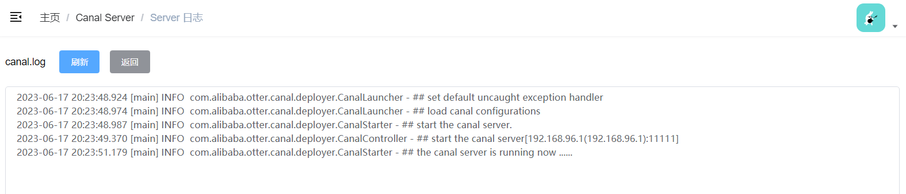  
网上有朋友遇到以下问题，那是因为jdk的版本问题。canal1.1.5使用jdk1.8即可，我使用的是canal1.1.6，该版本需要使用jdk11+，否则会报错NoSuchMethodError。
```
java.lang.NoSuchMethodError: java.nio.ByteBuffer.clear()Ljava/nio/ByteBuffer;
        at com.alibaba.otter.canal.client.impl.SimpleCanalConnector.readNextPacket(SimpleCanalConnector.java:412) ~[na:na]
        at com.alibaba.otter.canal.client.impl.SimpleCanalConnector.readNextPacket(SimpleCanalConnector.java:397) ~[na:na]
        at com.alibaba.otter.canal.client.impl.SimpleCanalConnector.doConnect(SimpleCanalConnector.java:155) ~[na:na]
        at com.alibaba.otter.canal.client.impl.SimpleCanalConnector.connect(SimpleCanalConnector.java:116) ~[na:na]
        at com.alibaba.otter.canal.connector.tcp.consumer.CanalTCPConsumer.connect(CanalTCPConsumer.java:63) ~[na:na]
        at com.alibaba.otter.canal.adapter.launcher.loader.AdapterProcessor.process(AdapterProcessor.java:185) ~[client-adapter.launcher-1.1.6.jar:na]
```
在主配置中统一修改集群下的服务端deployer的配置文件，也可以统一的查看集群下的服务端实例。  
在【Instance管理】中新增一个实例，也就是我们之前在服务端的conf文件夹下配置的，每一个子文件夹就代表了一个实例，每个实例都有自己的instance.properties配置文件，这里新增的实例就是这个配置文件：
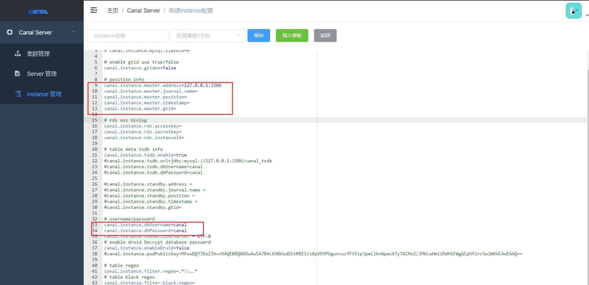  
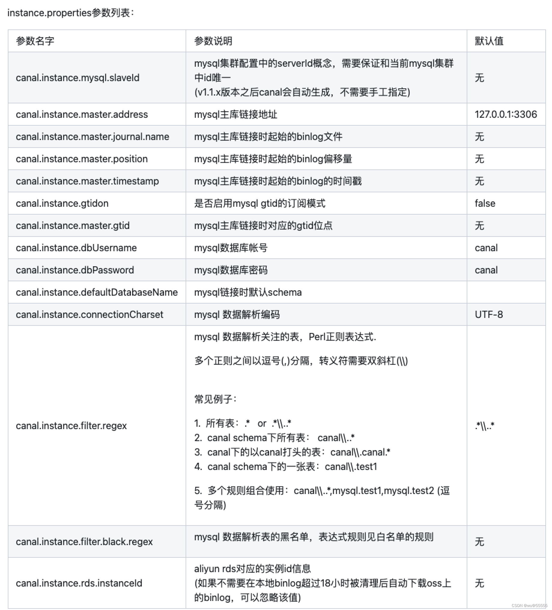  
在使用canal进行数据库日志获取的时候，第一次获取需要获取全量日志。在instance.properties中是可以进行配置的。其中：
>canal.instance.master.journal.name  
canal.instance.master.position  
canal.instance.master.timestamp  

这几个属性可以控制获取日志时候的起始位置。但是配置后重启canal并没有起作用。这是因为还需要消除canal目前的状态，就是将与instance.properties平级的meta.dat文件删除，这样canal才能从指定的位置获取日志。
配置示例：
```
#################################################
# 同mysql集群配置中的serverId，mysql的server_id参数
# canal.instance.mysql.slaveId=0
 
# 开启gtid，生成同步数据全局id，防止主从不一致
canal.instance.gtidon=true

# 需要连接的数据库地址及端口
canal.instance.master.address=127.0.0.1:3306 
#需要读取的起始的binlog文件
canal.instance.master.journal.name=mysql-bin.000003
#需要读取的起始的binlog文件的偏移量，通过show master status可以查看
canal.instance.master.position=14445
#需要读取的起始的binlog的时间戳
canal.instance.master.timestamp=

# 数据库账号
canal.instance.dbUsername=canal
# 数据库密码
canal.instance.dbPassword=canal
# 数据库解析编码格式
canal.instance.connectionCharset = UTF-8

# mysql 数据解析关注的表，Perl正则表达式
canal.instance.filter.regex=.*\\..*
# canal将会过滤那些不符合要求的table，这些table的数据将不会被解析和传送
canal.instance.filter.black.regex=
# 匹配table字段表达式，指定传递字段，不指定全传。
#(format: schema1.tableName1:field1/field2,schema2.tableName2:field1/field2)
#canal.instance.filter.field=test1.t_product:id/subject/keywords,test2.t_company:id
/name/contact/ch
# 匹配过滤table字段表达式，不传递的字段，canal.instance.filter.field为空时生效
@(format: schema1.tableName1:field1/field2,schema2.tableName2:field1/field2)
#canal.instance.filter.black.field=test1.t_product:subject/product_image,test2.t_company:id/name/contact/ch
 
# mq消息配置
# mq topic
canal.mq.topic=example
# 动态topic配置，topic为表名
#canal.mq.dynamicTopic=mytest1.user,mytest2\\..*,.*\\..*
# mq分区
canal.mq.partition=0
# hash分区数量 ，为空默认为1个分区
#canal.mq.partitionsNum=3
# hash分区主键，没有冒号就使用表名进行分区。有冒号使用字段进行分区。
#canal.mq.partitionHash=test.table:id^name,.*\\..*
```
点击"操作-启动"就可以启用该实例
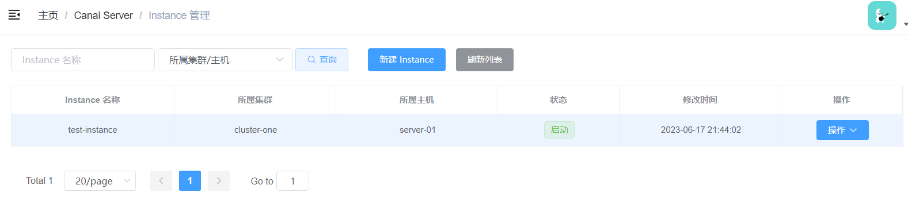

## 客户端adapter配置
针对客户端adapter，admin是不做管理的，如上我们配置了一个cluster的实例，如果要实现数据同步，我们还需要配置该实例对应的客户端来将该数据同步到目标数据源。

### Canal Java 入门与使用
Canal提供了各种语言的客户端，当Canal监听到binlog变化时，会通知Canal的客户端。不过这里我们会使用GitHub上的第三方开源的canal-starter。  
引入依赖：
```
<dependency>
    <groupId>top.javatool</groupId>
    <artifactId>canal-spring-boot-starter</artifactId>
    <version>1.2.1-RELEASE</version>
</dependency>
```
编写配置文件：
```
canal:
  server: 127.0.0.1:11111
  destination: test-instance  # canal实例名
```
编写监听器：
```
import com.alibaba.fastjson2.JSONObject;
import com.harvey.entity.HistoryLog;
import org.springframework.stereotype.Component;
import top.javatool.canal.client.annotation.CanalTable;
import top.javatool.canal.client.handler.EntryHandler;

@CanalTable("history_log")  //需要监听的表
@Component
public class HistoryLogHandler implements EntryHandler<HistoryLog> {//指定表关系实体类

    @Override
    public void insert(HistoryLog historyLog) {
        //新增数据时执行此方法
        System.out.println("insert：" + JSONObject.toJSONString(historyLog));
    }

    @Override
    public void update(HistoryLog before, HistoryLog after) {
        //更新数据时执行此方法
        System.out.println("update before：" + JSONObject.toJSONString(before));
        System.out.println("update after：" + JSONObject.toJSONString(after));
    }

    @Override
    public void delete(HistoryLog historyLog) {
        //删除数据时执行此方法
        System.out.println("delete：" + JSONObject.toJSONString(historyLog));
    }
}
```
实体类定义如下：
```
import lombok.Data;
import javax.persistence.Column;
import javax.persistence.Table;
import java.util.Date;

@Data
@Table(name = "history_log")
public class HistoryLog {

    @Column(name = "log_id")
    private Long logId;

    @Column(name = "log_msg")
    private String logMsg;

    @Column(name = "create_time")
    private Date createTime;
}
```
项目启动后，我们往数据库中插入数据，在控制台可以看到日志就证明成功了。

## Canal总结
canal的好处在于对业务代码没有侵入，因为是基于监听binlog日志去进行同步数据的。实时性也能做到准实时，其实是很多企业一种比较常见的数据同步的方案。  
实际项目我们是配置MQ模式，配合RocketMQ或者Kafka，canal会把数据发送到MQ的topic中，然后通过消息队列的消费者进行处理。  
Canal的部署也是支持集群的，需要配合ZooKeeper进行集群管理。

参考链接
[[Windows搭建canal服务]](https://www.cnblogs.com/xfeiyun/p/17468158.html) / [[Canal1.1.5最新版安装部署及详细配置]](https://blog.csdn.net/lizz861109/article/details/112369812)